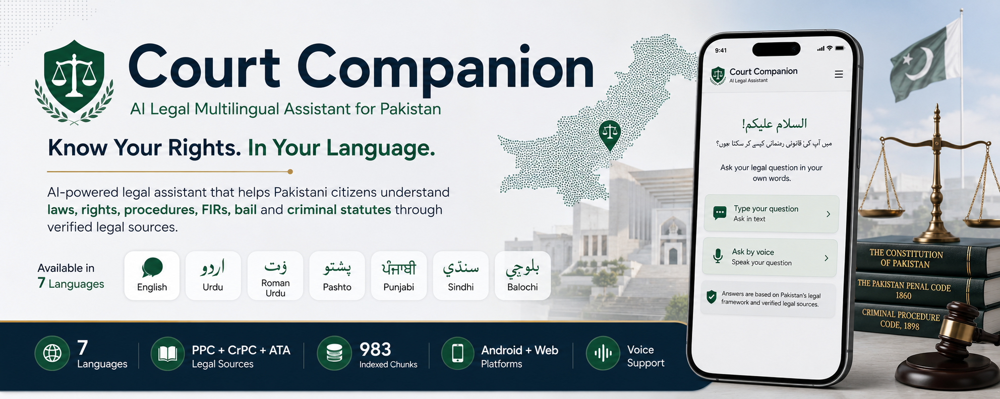

# Court Companion | AI Legal Multilingual Assistant

**Know Your Rights. In Your Language.**

An AI-powered legal assistant that helps Pakistani citizens understand laws, rights, procedures, FIRs, bail, and criminal statutes through **verified legal sources** — via **text** or **voice**.

> **Disclaimer:** Court Companion is an informational legal guide. It does not provide legal representation and does not replace professional legal counsel.

| | |
|---|---|
| **7 Languages** | English · Urdu · Roman Urdu · Pashto · Punjabi · Sindhi · Balochi |
| **Legal corpus** | PPC + CrPC + ATA — **983 indexed chunks** |
| **Platforms** | Android APK + Web |
| **Modes** | Text chat + Voice assistant (English voice; more languages coming) |
| **Live API** | [ai-legal-assistant-fes8.onrender.com](https://ai-legal-assistant-fes8.onrender.com/health) |

---

## Table of Contents

- [Overview](#overview)
- [Problem Statement](#problem-statement)
- [Proposed Solution](#proposed-solution)
- [Target Users](#target-users)
- [Features](#features)
  - [Implemented](#implemented)
  - [Planned](#planned)
- [RAG Architecture](#rag-architecture)
- [How the System Works](docs/LANGUAGE_AND_TRANSLATION.md) — full diagram + language pipelines (Devpost-ready)
- [AI Models](#ai-models)
- [Technology Stack](#technology-stack)
- [Quick Start](#quick-start)
- [Future Enhancements](#future-enhancements)
- [Expected Impact](#expected-impact)

---

## Overview

Court Companion reduces barriers to legal information by making laws, legal rights, and legal procedures easier to understand for people without legal expertise.

**Initial focus:** Criminal law awareness (PPC, CrPC, ATA)  
**Core approach:** Retrieval-Augmented Generation (RAG) — responses are grounded in verified statute text, not generic AI guesses.

---

## Problem Statement

Millions of citizens struggle to understand legal rights, criminal procedures, FIR processes, arrests, bail procedures, and PPC sections due to:

- Complex legal language
- Lack of affordable legal consultation
- Limited legal literacy
- Poor accessibility to legal information — especially in regional languages
- No AI legal assistant tailored to Pakistan's laws

**Consequences:** Misinformation, delayed legal action, reduced legal awareness, and barriers to justice.

---

## Proposed Solution

Court Companion provides a **multilingual** AI legal assistant that:

| Capability | Description |
|------------|-------------|
| **7-language Q&A** | Answers in English, Urdu (script), Roman Urdu, Pashto, Punjabi, Sindhi, Balochi |
| **Grounded answers** | Retrieves relevant PPC / CrPC / ATA sections before generating a reply |
| **Plain-language explanations** | AI simplifies statute text for ordinary citizens |
| **Text + voice** | Type or speak your question; hear answers as they stream |
| **Document upload** | Attach PDF/TXT for case-specific analysis |
| **Source citations** | Shows which legal sources informed each answer |

---

## Target Users

### Primary Users

- General citizens
- Students
- Rural communities
- Low-literacy users
- Individuals seeking legal awareness under stress or intimidation

### Secondary Users

- Legal aid organizations
- NGOs
- Community support groups
- Legal researchers

---

## Features

### Implemented

#### AI Legal Question Answering

Users can ask questions such as:

- What is an FIR?
- What are my rights after arrest?
- What is Section 302 PPC?
- How can I apply for bail?
- What punishment exists for theft?

The system retrieves relevant legal documents and generates understandable responses with **source citations**.

#### Retrieval-Augmented Generation (RAG)

```text
User Question
    → Language detection / translation (non-English → English for search)
    → Embedding Generation (all-MiniLM-L6-v2)
    → Hybrid Vector Search (FAISS — 983 chunks)
    → Retrieve Relevant Legal Chunks
    → Build Context + LLM Generation
    → Streamed Answer + Sources
```

#### Multilingual Support (7 languages)

| Language | Text chat | Voice |
|----------|-----------|-------|
| English | ✅ | ✅ |
| Urdu (اردو) | ✅ | Planned |
| Roman Urdu | ✅ | Planned |
| Pashto (پښتو) | ✅ | Planned |
| Punjabi (پنجابی) | ✅ | Planned |
| Sindhi (سنڌي) | ✅ | Planned |
| Balochi (بلوچی) | ✅ | Planned |

#### Voice Assistant

- **Speech-to-text** — ask by microphone (English)
- **Text-to-speech** — answers spoken as they stream
- Same RAG pipeline as text chat

#### Flutter Client

- **Web** (Chrome / Edge)
- **Android APK** (release build connects to Render automatically)
- Streaming chat UI, language picker, document attach, API status badge

#### Backend API (deployed)

- `GET /health` — index & LLM status
- `POST /ask` — legal Q&A
- `POST /ask/stream` — streaming NDJSON answers
- `POST /analyze-document` — PDF/TXT analysis

---

### Planned

| Module | Description |
|--------|-------------|
| **Admin dashboard** | Usage analytics, language breakdown, impact charts |
| **Feedback (👍 / 👎)** | Per-answer helpfulness ratings |
| **Voice — all 7 languages** | STT + TTS for every supported language |
| **Conversational memory** | Chat history, follow-up questions, agentic clarification |
| **Legal Resource Center** | Downloadable FIR templates, complaint forms, rights guides |
| **Lawyer Recommendation** | Category-based lawyer suggestions |
| **Firebase Auth + history** | Saved sessions for authenticated users |
| **Multi-instance deploy** | High availability, minimal downtime |

---

## RAG Architecture

### Knowledge Sources

| Source | Coverage |
|--------|----------|
| **Pakistan Penal Code (PPC)** | Offences, punishments, sections |
| **Criminal Procedure Code (CrPC)** | FIR, arrest, bail, investigation |
| **Anti-Terrorism Act (ATA)** | Scheduled offences & procedures |

**983 section-aware chunks** indexed with metadata (document, section, topic).

### Data Processing Pipeline

| Step | Action |
|------|--------|
| 1 | Collect legal PDFs (PPC, CrPC, ATA) |
| 2 | Section-aware chunking (`build_index.py`) |
| 3 | Generate embeddings (`all-MiniLM-L6-v2`) |
| 4 | Store in FAISS + `chunks.json` |

### Retrieval Process

```text
User Query (any of 7 languages)
    → IF question text is not English: translate_query() → English search string
    → Query Embedding (all-MiniLM-L6-v2 — English vectors)
    → FAISS Hybrid Search (TOP_K=8)
    → English statute chunks retrieved
    → LLM generates answer in user's chosen language (app picker)
    → Output guard + disclaimer
```

> **Deep dive:** [docs/LANGUAGE_AND_TRANSLATION.md](docs/LANGUAGE_AND_TRANSLATION.md) explains how search translation and response language work separately — including detection rules, models, and worked examples.

---

## AI Models

| Layer | Model | Provider | Purpose |
|-------|-------|----------|---------|
| **Search translation** | `meta-llama/Meta-Llama-3-8B-Instruct-Lite` | Together.ai | Non-English question → English for FAISS |
| **Answers** | `google/gemma-4-31B-it` | Together.ai | Explain English sources in user's language |
| **Embeddings** | `all-MiniLM-L6-v2` | sentence-transformers | English semantic search |

*Models are under active evaluation for quality, latency, and cost at civic scale.*

---

## Technology Stack

| Layer | Technology |
|-------|------------|
| **Frontend** | Flutter (Dart) — Android, Web |
| **Backend** | FastAPI (Python) |
| **Vector search** | FAISS (file-based, 983 vectors) |
| **LLM API** | Together.ai |
| **Hosting** | Render (HTTPS) |
| **Voice** | `speech_to_text`, browser TTS / `flutter_tts` |

---

## Quick Start

### Backend (local)

```bash
cd backend
python -m venv .venv
.venv\Scripts\activate          # Windows
pip install -r requirements.txt
uvicorn main:app --host 0.0.0.0 --port 8000
```

### Flutter (web — production API)

```bash
cd Frontend
flutter pub get
flutter run -d chrome --dart-define=API_BASE_URL=https://ai-legal-assistant-fes8.onrender.com
```

### Android APK (release — uses Render automatically)

```bash
cd Frontend
flutter build apk --release
# Output: build/app/outputs/flutter-apk/app-release.apk
```

See also: [`Frontend/README.md`](Frontend/README.md) · [`SUBMISSION_SCREENING.md`](SUBMISSION_SCREENING.md)

---

## Future Enhancements

- Full voice support in all 7 languages
- Agentic follow-up questions and session memory
- Admin analytics and citizen feedback loop
- Open-source release with multi-deployment instances
- Constitutional, civil, and family law expansion
- Government and NGO partnerships

---

## Expected Impact

Court Companion aims to:

- Improve legal literacy across Pakistan's language communities
- Increase access to trustworthy legal information on mobile
- Reduce dependence on informal misinformation
- Empower citizens to understand their rights calmly and clearly

**Long-term vision:** Pakistan's most accessible AI-powered multilingual legal information platform.

---

*AI for Civic Innovation Hackathon 2026 — Code for Pakistan × Grey Software × Scrimba × FAST NUCES*
