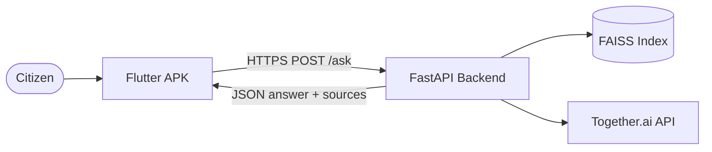
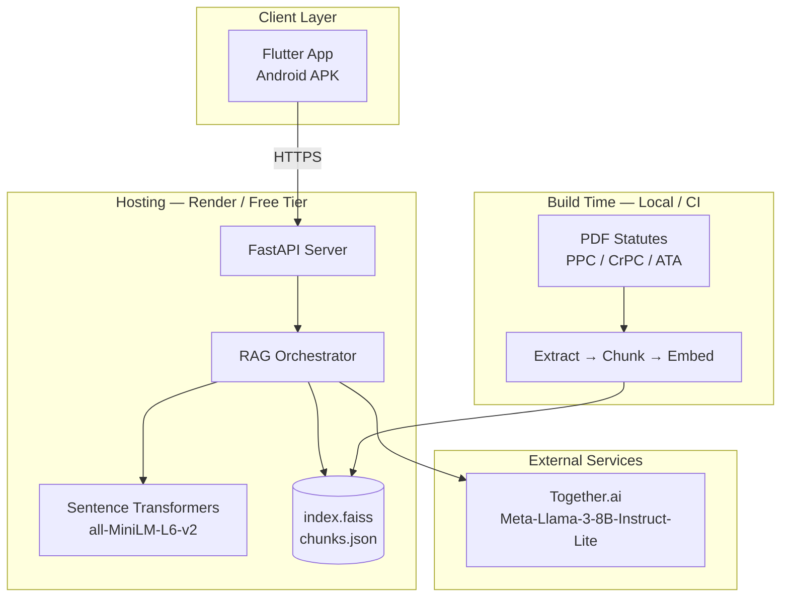
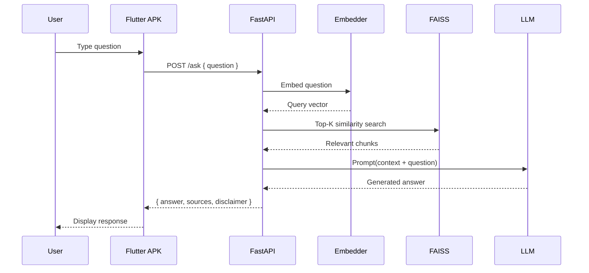
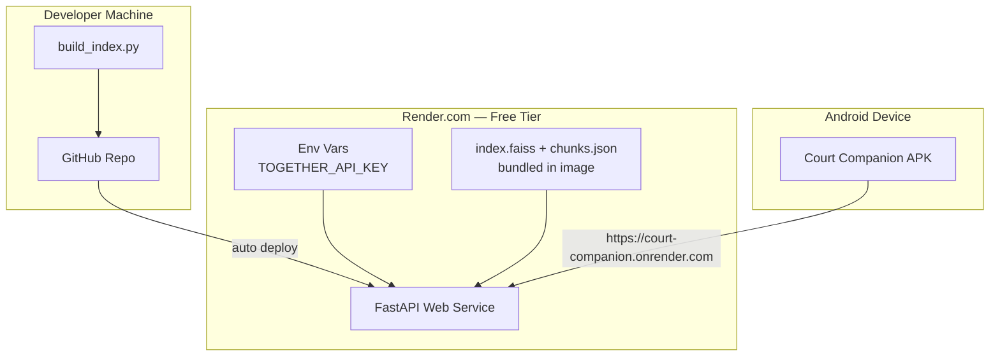

# Architecture — Court Companion

**Version:** 1.0 (Hackathon MVP)  
**Last updated:** 2026-06-10

---

## 1. Overview

Court Companion is a **stateless, RAG-backed legal Q&A system**. A Flutter mobile client sends questions to a deployed FastAPI backend. The backend retrieves relevant statute chunks from a pre-built FAISS index and uses an external LLM API to generate simplified answers with source citations.

**No application database** is used in the MVP — each request is independent.

---

## 2. System Context



---

## 3. High-Level Architecture



---

## 4. Component Design

### 4.1 Flutter client

| Responsibility | Details |
|----------------|---------|
| UI | Chat screen — input, message list, loading/error states |
| Networking | `http` or `dio` → `POST /ask` |
| Config | `API_BASE_URL` via `--dart-define` or env file |
| Platform | Android APK (primary); web optional later |

**Does not:** Run embeddings, hold API keys, or store user data.

### 4.2 FastAPI backend

| Module | Responsibility |
|--------|----------------|
| `main.py` | App entry, routes, CORS, lifespan |
| `rag/retriever.py` | Load FAISS + chunks; similarity search |
| `rag/embedder.py` | Query embedding via Sentence Transformers |
| `rag/generator.py` | Prompt construction + LLM call |
| `rag/prompts.py` | System prompt — context-only answers |
| `config.py` | Env vars: `TOGETHER_API_KEY`, `LLM_MODEL`, `TOP_K` |

### 4.3 Knowledge index (FAISS)

| Artifact | Description |
|----------|-------------|
| `index.faiss` | Vector index (~350–400 vectors) |
| `chunks.json` | Chunk text, source file, section metadata |

Built offline via `scripts/build_index.py` — not at server request time.

### 4.4 LLM provider — Together.ai

| Property | Value |
|----------|-------|
| Provider | [Together.ai](https://www.together.ai/) |
| SDK | `together` Python package |
| Model | `meta-llama/Meta-Llama-3-8B-Instruct-Lite` |
| Access | `TOGETHER_API_KEY` in server environment only |
| Role | Generate natural-language answer from retrieved context |

**Example (server-side):**

```python
from together import Together

client = Together()  # reads TOGETHER_API_KEY from env

response = client.chat.completions.create(
    model="meta-llama/Meta-Llama-3-8B-Instruct-Lite",
    messages=[
        {"role": "system", "content": system_prompt_with_legal_context},
        {"role": "user", "content": user_question},
    ],
)
answer = response.choices[0].message.content
```

---

## 5. RAG Pipeline



### 5.1 Ingestion pipeline (offline)

```text
data/*.pdf
    → extract text (pypdf)
    → normalize whitespace
    → chunk (500–1000 tokens, 50–100 overlap)
    → embed (all-MiniLM-L6-v2)
    → save index.faiss + chunks.json
```

### 5.2 Query pipeline (runtime)

```text
user question
    → embed query
    → FAISS top-K search (K=5)
    → assemble context block
    → LLM prompt (strict: answer from context only)
    → parse response + attach source metadata
```

### 5.3 Prompt strategy

- System: legal information assistant for Pakistan; answer only from context
- Context: top-K retrieved chunks with source labels
- User: original question
- Fallback: if context insufficient, respond with uncertainty — do not invent law

---

## 6. API Specification

### `GET /health`

**Response `200`:**

```json
{
  "status": "ok",
  "index_loaded": true,
  "chunk_count": 387
}
```

### `POST /ask`

**Request:**

```json
{
  "question": "What is an FIR?"
}
```

**Response `200`:**

```json
{
  "answer": "An FIR (First Information Report) is...",
  "sources": [
    {
      "document": "Code_of_criminal_procedure_1898.pdf",
      "section": "154",
      "excerpt": "Information in cognisable cases..."
    }
  ],
  "disclaimer": "This is informational guidance only, not legal advice."
}
```

**Response `400`:** Missing or empty question  
**Response `503`:** Index not loaded or LLM unavailable

---

## 7. Data Architecture

### 7.1 Knowledge sources

| Document | Statute | ~Tokens | Role |
|----------|---------|---------|------|
| `Pakistan Penal Code.pdf` | PPC | ~91K | Substantive offences |
| `Code_of_criminal_procedure_1898.pdf` | CrPC | ~134K | FIR, arrest, bail, procedure |
| `Anti-Terrorism-Act-1997.pdf` | ATA | ~27K | Terrorism offences |

### 7.2 Storage model

| Data | Storage | Mutable at runtime? |
|------|---------|---------------------|
| Source PDFs | `data/` (repo) | No |
| FAISS index | `backend/rag/index/` | No — rebuilt offline |
| Chunk metadata | `chunks.json` | No |
| User data | None | N/A |

**Why FAISS over ChromaDB / Postgres:**

- ~400 chunks — small corpus
- File-based — no extra service on Render
- Fast startup — load index into memory once
- Zero cost

---

## 8. Deployment Architecture



### 8.1 Deployment checklist

| Step | Action |
|------|--------|
| 1 | Run `build_index.py` locally |
| 2 | Commit index artifacts (or build in Dockerfile) |
| 3 | Set `TOGETHER_API_KEY` in Render env |
| 4 | Deploy FastAPI with `uvicorn` |
| 5 | Verify `GET /health` |
| 6 | Point Flutter `API_BASE_URL` to Render URL |
| 7 | `flutter build apk --release` |

### 8.2 Environment variables

| Variable | Required | Description |
|----------|----------|-------------|
| `TOGETHER_API_KEY` | Yes | Together.ai API key |
| `LLM_MODEL` | No | Default: `meta-llama/Meta-Llama-3-8B-Instruct-Lite` |
| `TOP_K` | No | Retrieval count (default: 5) |
| `INDEX_PATH` | No | Path to FAISS index directory |

---

## 9. Security

| Concern | Approach |
|---------|----------|
| API keys | Server env only — never in Flutter APK |
| Transport | HTTPS in production |
| Auth | None for MVP (stateless public API) |
| Rate limiting | Optional middleware post-MVP |
| Legal liability | Disclaimer on every response |
| Input validation | Sanitize question length; reject empty input |

---

## 10. Repository Structure (planned)

```text
ai_legal_assistant/
├── backend/
│   ├── main.py
│   ├── config.py
│   ├── requirements.txt
│   ├── Dockerfile
│   ├── rag/
│   │   ├── retriever.py
│   │   ├── embedder.py
│   │   ├── generator.py
│   │   ├── prompts.py
│   │   └── index/
│   │       ├── index.faiss
│   │       └── chunks.json
│   └── scripts/
│       └── build_index.py
├── Frontend/                    # Flutter mobile app
├── data/
│   ├── *.pdf
│   └── README.md
├── docs/
│   ├── PRD.md
│   └── ARCHITECTURE.md
├── progress-updates/
├── Hackathon_updates/
└── README.md
```

---

## 11. Technology Stack

| Layer | Technology |
|-------|------------|
| Mobile | Flutter (Dart) |
| API | FastAPI (Python 3.11+) |
| Embeddings | sentence-transformers (`all-MiniLM-L6-v2`) |
| Vector search | FAISS |
| LLM | Together.ai — `meta-llama/Meta-Llama-3-8B-Instruct-Lite` |
| PDF parsing | pypdf |
| Hosting | Render (free tier) |
| Database | None (MVP) |

---

## 12. Scalability Notes (Post-MVP)

| Bottleneck | Future option |
|------------|---------------|
| In-memory FAISS | ChromaDB, Pinecone, or pgvector |
| Single Render instance | Horizontal scaling + load balancer |
| No auth | Firebase Auth + API keys per client |
| English only | Translation layer or Urdu corpus |
| Cold start | Paid Render tier or Fly.io always-on |

---

## 13. References

- [PRD.md](./PRD.md) — Product requirements
- [data/README.md](../data/README.md) — Corpus inventory
- [progress-updates/STATUS_TRACKER.md](../progress-updates/STATUS_TRACKER.md) — Implementation progress
