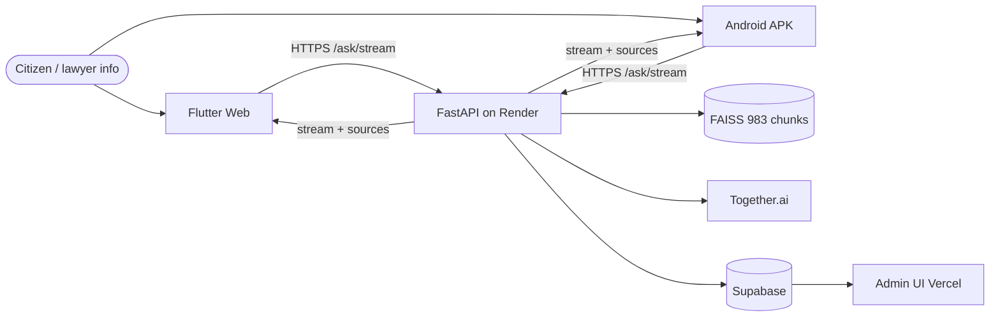
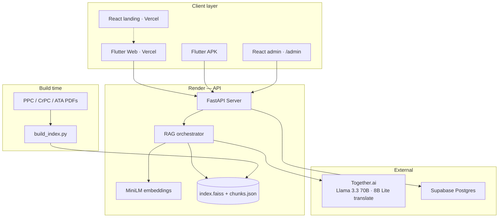
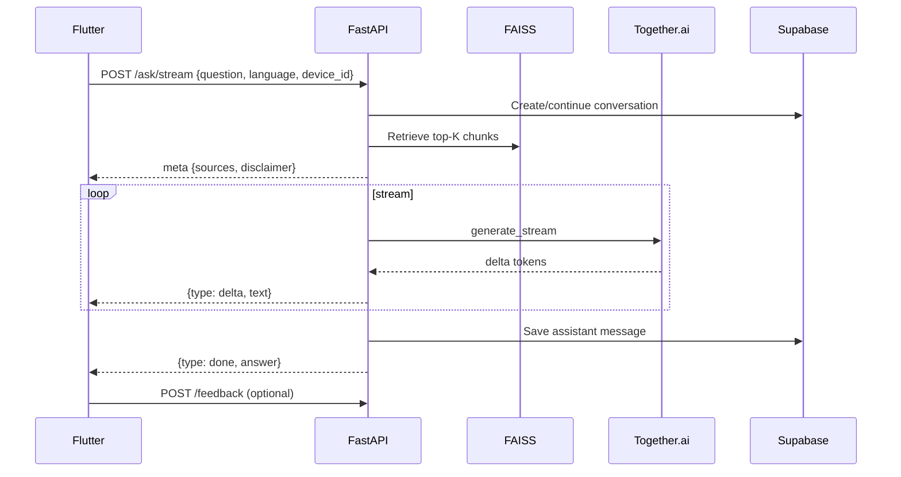
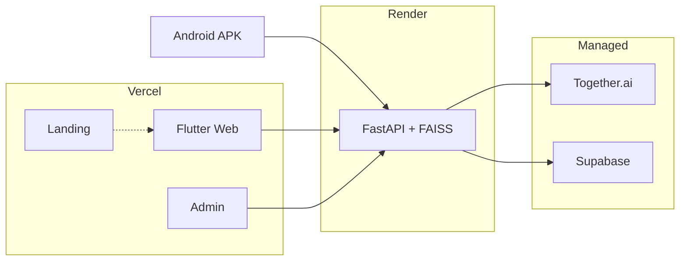

# Architecture — Court Companion

**Version:** 1.2  
**Last updated:** 2026-06-17

**Presentation diagram (judges / slides):** [`ARCHITECTURE_PRESENTATION.md`](./ARCHITECTURE_PRESENTATION.md) — landscape 16:9, plain-English labels.

---

## 1. Overview

Court Companion is a **RAG-backed legal assistant** for Pakistani criminal law. Flutter clients (web + Android) send questions and **real-world scenarios** to a FastAPI backend on Render. The backend retrieves relevant statute chunks from a pre-built FAISS index and uses Together.ai LLMs to generate structured answers — applicable law, CrPC procedure, rights, and next steps — with source citations in the user's chosen language.

| Surface | URL |
|---------|-----|
| **Flutter web** | https://ai-legal-assistant-two.vercel.app/ |
| **Landing + admin** | https://ai-legal-assistant-seven.vercel.app/ |
| **API** | https://ai-legal-assistant-fes8.onrender.com |

**Citizen chat:** Multi-turn context via `conversation_id` + Supabase; opening chat from home starts a **fresh thread** (past chats via sidebar). **Court Companion Pro** (lawyers) — beta info screen in app; full workspace planned — see [`COURT_COMPANION_PRO.md`](COURT_COMPANION_PRO.md).

**Shipped:** Admin impact dashboard (`/admin`), market traction survey page (`/admin/traction`), feedback APIs, usage analytics, chat history, voice (EN + Urdu).

---

## 2. System Context



---

## 3. High-Level Architecture



---

## 4. Component Design

### 4.1 Flutter client (`Frontend/`)

| Responsibility | Details |
|----------------|---------|
| UI | **Home** — Ask in chat · Ask by voice · Court Companion Pro. **Chat** — streaming, history sidebar, PDF attach, 👍/👎. **Voice** — STT + TTS (EN + UR). **Pro** — product info screen |
| Networking | `POST /ask/stream`, conversations CRUD, `/feedback`, `/analyze-document` |
| Identity | Anonymous `device_id` (localStorage on web, SharedPreferences on APK) |
| Config | `api_config.dart` — production Render URL in release builds |
| Platform | **Flutter web** (Vercel) + **Android APK** |

**Does not:** Run embeddings, hold API keys, or require citizen login.

### 4.2 React web (`web_frontend/`)

| Route | Purpose |
|-------|---------|
| `/` | Marketing landing — hero, features, Pro, get app |
| `/admin` | Live impact dashboard — KPIs, charts, feedback |
| `/admin/traction` | Pre-launch Google Form survey validation |

### 4.3 FastAPI backend (`backend/`)

| Module | Responsibility |
|--------|----------------|
| `main.py` | Routes, CORS, streaming `/ask/stream`, admin stats, feedback |
| `rag/retriever.py` | FAISS + hybrid keyword signals |
| `rag/embedder.py` | Query embedding (MiniLM) |
| `rag/generator.py` | LLM prompts, translation, streaming |
| `conversations/` | Supabase conversation + message persistence |
| `feedback/` | Thumbs up/down per answer |
| `analytics/` | Usage events, topic detection, admin aggregates |
| `admin/` | `X-Admin-Key` protected stats endpoints |

### 4.4 Knowledge index (FAISS)

| Artifact | Description |
|----------|-------------|
| `index.faiss` | Vector index — **983 chunks** |
| `chunks.json` | Text, document, section metadata |

Built offline via `scripts/build_index.py`.

### 4.5 LLM provider — Together.ai

| Role | Model |
|------|-------|
| **Answer generation** | `meta-llama/Llama-3.3-70B-Instruct-Turbo` (`LLM_MODEL`) |
| **Query translation** | `meta-llama/Meta-Llama-3-8B-Instruct-Lite` (`TRANSLATION_MODEL`) |
| **Embeddings** | `all-MiniLM-L6-v2` (local via sentence-transformers; no API cost) |

Models are **env-configurable** — swap `LLM_MODEL` without app rebuild.

---

## 5. RAG Pipeline

### 5.1 Dual language pipelines

| Pipeline | Purpose |
|----------|---------|
| **A — Search translation** | Non-English question → English query for FAISS |
| **B — Response language** | LLM writes answer in user's selected language (7 options) |

### 5.2 Streaming query flow



### 5.3 Prompt strategy

- Answer **only** from retrieved context
- Attach statute source metadata to every legal answer
- Disclaimer on every response
- Output sanitization preserves Urdu script

---

## 6. API surface (key endpoints)

| Method | Path | Purpose |
|--------|------|---------|
| `GET` | `/health` | Index + DB status |
| `POST` | `/ask/stream` | NDJSON streaming RAG answers |
| `POST` | `/ask` | Non-streaming (legacy) |
| `POST` | `/analyze-document` | PDF/TXT upload |
| `GET/POST` | `/conversations` | Chat history (device-scoped) |
| `POST` | `/feedback` | 👍/👎 per message |
| `GET` | `/admin/stats/*` | Dashboard KPIs (admin key) |
| `GET` | `/admin/feedback/recent` | Recent ratings |

---

## 7. Data Architecture

### 7.1 Knowledge sources

| Document | Statute |
|----------|---------|
| Pakistan Penal Code | PPC |
| Code of Criminal Procedure 1898 | CrPC |
| Anti-Terrorism Act 1997 | ATA |

### 7.2 Storage model

| Data | Storage | Notes |
|------|---------|-------|
| Statute PDFs | `data/` | Repo |
| FAISS index | `backend/rag/index/` | Rebuilt offline |
| Conversations | Supabase `conversations` | Per `device_id` |
| Messages | Supabase `messages` | User + assistant rows |
| Feedback | Supabase `answer_feedback` | Per message + device |
| Usage events | Supabase `usage_events` | Topics, languages, channels |
| Survey traction | `web_frontend/src/admin/data/surveyTraction.js` | Google Form snapshot |

---

## 8. Deployment Architecture



| Component | Host | Root |
|-----------|------|------|
| API | Render | `backend/` |
| Flutter web | Vercel | `Frontend/` |
| Landing + admin | Vercel | `web_frontend/` |

See also: [`FLUTTER_WEB_DEPLOY.md`](./FLUTTER_WEB_DEPLOY.md), [`SUPABASE_SETUP.md`](./SUPABASE_SETUP.md).

### 8.1 Environment variables (API)

| Variable | Required | Description |
|----------|----------|-------------|
| `TOGETHER_API_KEY` | Yes | Together.ai |
| `LLM_MODEL` | No | Default 8B Lite; production: Llama 3.3 70B Instruct Turbo |
| `SUPABASE_URL` | For history/analytics | Postgres backend |
| `SUPABASE_SERVICE_ROLE_KEY` | For history/analytics | Server only |
| `ADMIN_API_KEY` | For `/admin` | Organizer dashboard |

---

## 9. Security

| Concern | Approach |
|---------|----------|
| API keys | Server env only — never in Flutter |
| Admin | `X-Admin-Key` header; sessionStorage in browser |
| Transport | HTTPS (Vercel + Render) |
| Citizen auth | None — anonymous `device_id` |
| Legal liability | Disclaimer on every response |

---

## 10. Repository structure

```text
ai_legal_assistant/
├── backend/           # FastAPI, RAG, admin APIs
├── Frontend/          # Flutter (web + APK)
├── web_frontend/      # React landing + admin
├── data/              # Statute PDFs
├── docs/
│   ├── ARCHITECTURE.md
│   └── ARCHITECTURE_PRESENTATION.md   # Judge slide diagrams
└── README.md
```

---

## 11. Technology stack

| Layer | Technology |
|-------|------------|
| Mobile + web client | Flutter (Dart) |
| Marketing + admin | React, Vite, Tailwind, Framer Motion |
| API | FastAPI (Python 3.11+) |
| Embeddings | sentence-transformers (`all-MiniLM-L6-v2`) |
| Vector search | FAISS (983 vectors) |
| LLM | Together.ai (Llama 3.3 70B answers + Llama 3 8B Lite translation) |
| Database | Supabase PostgreSQL |
| Hosting | Render + Vercel (free tiers) |

---

## 12. Scalability notes

| Bottleneck | Path forward |
|------------|--------------|
| In-memory FAISS | pgvector / Pinecone when case-law corpus grows |
| Single Render instance | Horizontal replicas + load balancer |
| Cold start (~30–50s) | Paid Render or always-on tier |
| Free-tier limits | NGO/sponsor budget — pennies per question on Together.ai |

Citizen tier stays stateless-friendly; **Court Companion Pro** adds case workspaces on same Supabase pattern.

---

## 13. References

- [`ARCHITECTURE_PRESENTATION.md`](./ARCHITECTURE_PRESENTATION.md) — landscape diagrams for pitch
- [`PRD.md`](./PRD.md) — Product requirements
- [`COURT_COMPANION_PRO.md`](./COURT_COMPANION_PRO.md) — Lawyer tier design
- [`LANGUAGE_AND_TRANSLATION.md`](./LANGUAGE_AND_TRANSLATION.md) — 7-language pipeline
- [`FLUTTER_WEB_DEPLOY.md`](./FLUTTER_WEB_DEPLOY.md) — Vercel Flutter web
