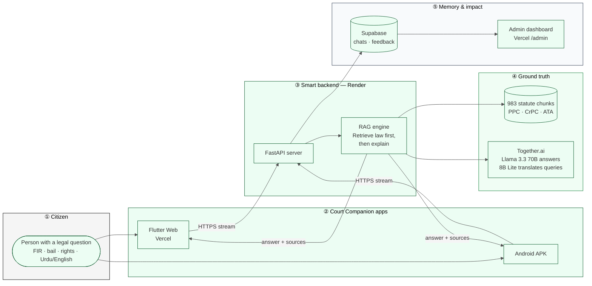
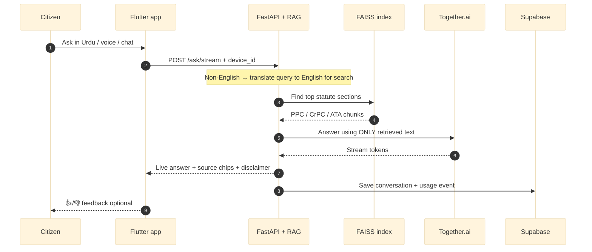
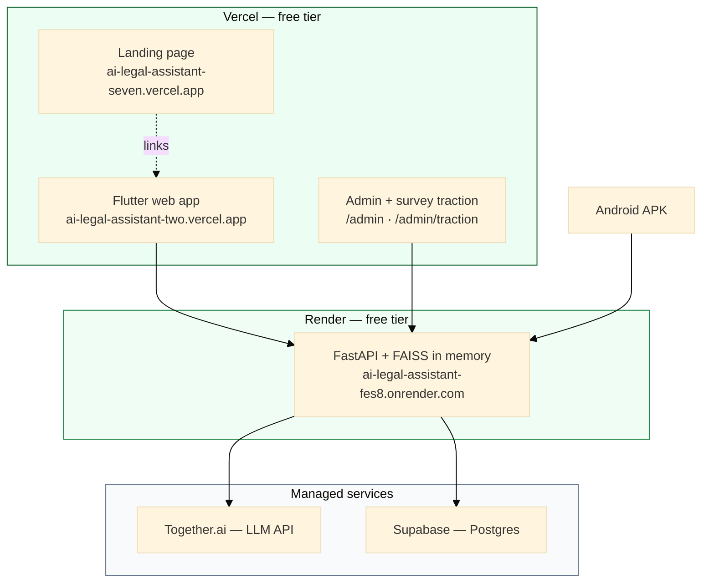

# Court Companion — Technical Architecture (Presentation)

**Use this for pitch slides, Devpost, and judge Q&A.**  
**Layout:** landscape 16:9 — copy the Mermaid block into [mermaid.live](https://mermaid.live) and export PNG/SVG for PowerPoint / Canva / Google Slides.

**Version:** 1.0 · 2026-06-17

---

## One-slide diagram (recommended for judges)

Plain English on top, technical labels underneath. Left → right = citizen journey.

### 30-second narration (memorize this)

> A citizen asks a real question on **web or Android**. Our **FastAPI backend** does not guess — it **searches 983 real Pakistani law chunks** (PPC, CrPC, ATA) using **MiniLM embeddings**, then **Llama 3.3 70B** explains the answer in plain language in **7 languages**, with **source citations**. Chats and feedback go to **Supabase**; organizers see **live impact** on the admin dashboard. **No API keys on the phone** — all AI runs server-side.

---

## Slide 2 — How one question flows (optional deep-dive)

---

## Slide 3 — What we deploy (infrastructure)

---

## Design notes for slides

| Tip | Detail |
|-----|--------|
| **Orientation** | Landscape 16:9 — use diagram 1 full-width |
| **Colors** | Match landing: green `#0d5c2e`, neutral `#fafafa`, dark text `#0a0a0a` |
| **Export** | mermaid.live → PNG 1920×1080 or SVG |
| **Audience** | Say layer numbers aloud: "Step 1 citizen… Step 4 ground truth…" |
| **Trust hook** | Point to FAISS + source chips: "AI quotes real law, not imagination" |

---

## Live URLs (for slide footer)

| Resource | URL |
|----------|-----|
| Web app | https://ai-legal-assistant-two.vercel.app/ |
| Landing | https://ai-legal-assistant-seven.vercel.app/ |
| API health | https://ai-legal-assistant-fes8.onrender.com/health |
| Admin | https://ai-legal-assistant-seven.vercel.app/admin |
