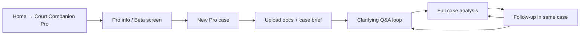
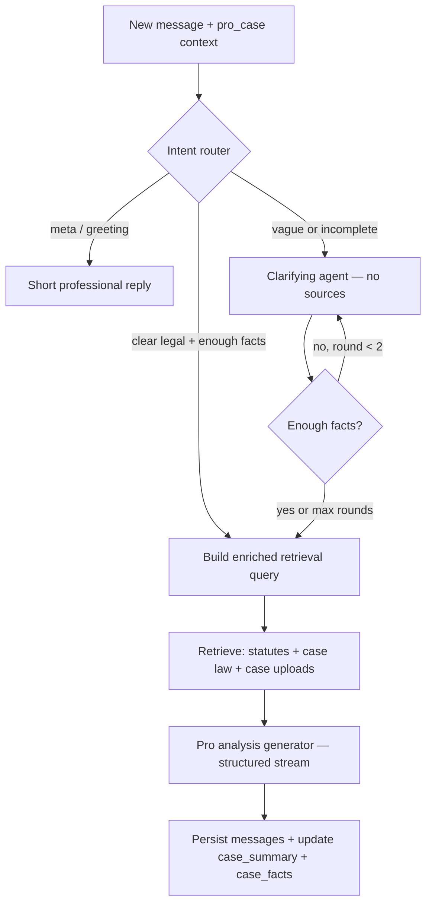

# Court Companion Pro — Professional Case Workspace

**Product:** Court Companion Pro  
**Version:** 0.1 (Planning)  
**Last updated:** 2026-06-17  
**Status:** Design only — **Beta preview in app** (no backend yet)  
**Pricing:** Free during beta · Paid subscription planned

---

## 0. One-line vision

**Court Companion Pro** is a professional-grade case workspace for **lawyers, advocates, and legal professionals** in Pakistan. Unlike the citizen **Ask in chat** flow (quick legal information), Pro holds the **full case narrative** across every turn — uploaded documents, agentic clarifying questions, statute + **case-law** retrieval, procedural gaps, and structured analysis grounded in public judgments from the **Supreme Court, High Courts, and Sessions Courts**.

---

## 1. Citizen chat vs Pro

| | **Ask in chat** (free) | **Court Companion Pro** (paid after beta) |
|---|------------------------|-------------------------------------------|
| **Audience** | Citizens, general public | Lawyers, advocates, legal researchers |
| **Goal** | Understand rights, FIR, bail, PPC sections | Analyse a **specific case file** or client scenario |
| **Input** | Short questions, optional single document | Full case brief, pleadings, FIR copies, orders, chronology |
| **Memory** | Last ~10 turns per conversation | **Entire case context** for the life of the workspace |
| **Follow-ups** | User asks next question | **AI asks clarifying questions** when facts are missing |
| **Knowledge** | PPC, CrPC, ATA (statutes) | Statutes **+ solved case law** from Pakistani courts |
| **Output** | Plain-language legal information | Structured analysis: facts, issues, law, precedents, gaps, next steps |
| **Login** | None (device-only) | Professional account (planned) |

---

## 2. Problem Pro solves

Citizens ask *“What is bail?”*  
Lawyers ask *“Given these FIR facts, prior convictions, and the Lahore High Court order attached — is interim bail likely, which CrPC provisions apply, and what did the Supreme Court hold in similar snatching cases?”*

That requires:

1. **Persistent case context** — not a stateless Q&A.
2. **Agentic fact-gathering** — the system must ask before it cites the wrong section.
3. **Case-law retrieval** — statutes alone are not enough; precedents matter.
4. **Gap / loophole awareness** — procedural defects, limitation, jurisdiction, evidence gaps.
5. **Professional tone** — cite sources, separate disputed vs established facts, no guilt/innocence calls.

---

## 3. Core capabilities (planned)

### 3.1 Case workspace (one case = one long-lived context)

Each **Pro case** is a dedicated workspace:

- **Title** — e.g. *“State vs Ali — bail application”*
- **Case type** — criminal / anti-terrorism / procedural review / other
- **Court level** — Sessions / High Court / Supreme Court (for routing retrieval)
- **Parties, dates, FIR/CNR references** (structured fields + free text)
- **Uploaded files** — PDF, TXT (FIR, challan, orders, affidavits, judgments)
- **Timeline** — extracted events with dates
- **Running case summary** — auto-updated after each turn (for LLM + retrieval)

All messages, clarifying rounds, and analyses stay linked to **one `pro_case_id`** until the lawyer archives or deletes the case.

### 3.2 Agentic follow-up questions

When input is vague or legally incomplete, Pro enters a **clarifying phase** before citing law.

**Example**

**Lawyer:** `Client’s phone was taken on Mall Road.`

**Pro (clarifying — no sources yet):**
```
To identify the correct PPC framework and precedents, please confirm:

1. Was the phone snatched from the hand (force), picked without presence, or taken by deception?
2. Was anyone injured or threatened?
3. Is an FIR registered? If yes, which sections are cited?
4. Which court/forum is this for — police complaint, Sessions trial, or bail before arrest?
```

**Lawyer:** `Snatched from hand, no injury, FIR under 379 at Civil Lines, bail before arrest in Lahore.`

**Pro (full analysis — statutes + case law + procedure):**
- Applicable PPC sections (379 vs 356/392 reasoning)
- Relevant CrPC bail provisions
- Matching public judgments (snatching, bail before arrest)
- Procedural checklist and **gaps** (e.g. missing witness statements, limitation)

**Rules (v1):**
- Max **2 clarifying rounds**, then best-effort analysis + explicit uncertainty
- Clarifying replies: **no statute punishment claims** — only questions
- Voice mode: max **2 short questions** per round

### 3.3 Document & scenario upload

- Multi-file upload per case (not single-file like citizen document analyse)
- OCR / text extraction pipeline (reuse `document_parser`)
- Chunking + embedding into **case-private index** (this case only) **and** query against **global case-law index**
- Lawyer can paste a **scenario brief** instead of files

### 3.4 Case-law knowledge base (backend — planned)

Public, non-paywalled judgments and orders from:

| Source | Examples |
|--------|----------|
| **Supreme Court of Pakistan** | Published judgments, leave grants |
| **High Courts** | Lahore, Sindh, Peshawar, Balochistan, Islamabad |
| **Sessions / trial courts** | Where publicly available via official or licensed open repositories |

**Ingestion pipeline (future):**
1. Crawl / bulk import from approved public sources only
2. Normalize metadata: court, bench, date, citation, parties, sections cited
3. Chunk by **issues held**, **ratio**, **facts**, **order**
4. FAISS (or pgvector) index separate from PPC/CrPC statute index
5. Hybrid retrieval: `statute_chunks ∪ case_law_chunks ∪ case_upload_chunks`

**Legal note:** Only **publicly available** judgments; respect robots/terms of source sites; no scraping behind paywalls.

### 3.5 Structured Pro analysis output

Each “full answer” phase returns (streamed):

1. **Facts understood** (established vs disputed)
2. **Legal issues identified**
3. **Applicable statutes** (PPC / CrPC / ATA) with retrieved excerpts
4. **Relevant precedents** (case name, court, year, holding summary)
5. **Procedural position** — FIR → investigation → remand → bail → trial
6. **Gaps & risks** — missing documents, weak elements, limitation, jurisdiction
7. **Suggested next steps** — for counsel, not citizen DIY
8. **Disclaimer** — research aid only; counsel remains responsible

### 3.6 Loophole & procedural gap detection (heuristic + LLM)

Planned checks (non-exhaustive):

- FIR delay / unexplained delay (jurisdiction for complaint under CrPC)
- Wrong or missing sections in FIR vs facts alleged
- Bail category (bailable / non-bailable / §497/498 CrPC)
- Remand beyond statutory period
- Confession / identification / 164 CrPC compliance flags
- Limitation / territorial jurisdiction
- Contradictions between uploaded documents and lawyer’s narrative

Output is **informational flags**, not a guarantee of outcome.

---

## 4. User journey (Flutter — planned UI)

### Home screen (current app)

| Order | Card | Action |
|-------|------|--------|
| 1 | **Ask in chat** | Citizen text Q&A (free) |
| 2 | **Ask by voice** | Voice assistant (free) |
| 3 | **Court Companion Pro** | Beta info screen → this product (workspace coming soon) |

There is **no** separate “Analyze document” button on home. Document attach remains optional inside **Ask in chat** only.



**Beta (current):** Home shows **Court Companion Pro** card → **info screen only** (this document surfaced in app). No case creation yet.

**Post-beta:** Same entry → case list → open case → chat workspace with Pro chrome (phase badges: *Gathering details*, *Analysing*, *Case law*).

---

## 5. Orchestration pipeline (backend — planned)



**Phases** (stored on `messages.phase`):

| Phase | UI badge | Sources shown |
|-------|----------|---------------|
| `clarifying` | Gathering details | None |
| `reasoning` | Analysing case | Optional preview |
| `answering` | Full analysis | Statutes + judgments |
| `conversational` | — | None |

---

## 6. Database updates required (Supabase)

Citizen `conversations` / `messages` are **not sufficient** for Pro. Plan a **separate schema** (or `tier` column) so one case keeps **all context** without mixing with citizen chat.

### 6.1 New tables (recommended)

```sql
-- Professional accounts (post-beta; optional during beta with device flag)
create table public.pro_users (
  id uuid primary key default gen_random_uuid(),
  email text unique,
  full_name text,
  bar_council_id text,
  firm_name text,
  subscription_status text not null default 'beta'
    check (subscription_status in ('beta', 'active', 'expired', 'cancelled')),
  created_at timestamptz not null default now(),
  updated_at timestamptz not null default now()
);

-- One row per lawyer case file — long-lived context
create table public.pro_cases (
  id uuid primary key default gen_random_uuid(),
  pro_user_id uuid references public.pro_users(id) on delete cascade,
  device_id text,  -- beta fallback before login
  title text not null,
  case_type text,
  court_level text,
  status text not null default 'open'
    check (status in ('open', 'archived', 'deleted')),
  language text not null default 'english',
  case_summary text,           -- rolling LLM summary for retrieval
  case_facts jsonb not null default '{}'::jsonb,
  clarifying_complete boolean not null default false,
  clarifying_rounds int not null default 0,
  metadata jsonb not null default '{}'::jsonb,
  created_at timestamptz not null default now(),
  updated_at timestamptz not null default now()
);

create index pro_cases_user_updated_idx
  on public.pro_cases (pro_user_id, updated_at desc);

-- Messages — same shape as citizen but FK to pro_cases
create table public.pro_messages (
  id uuid primary key default gen_random_uuid(),
  pro_case_id uuid not null references public.pro_cases(id) on delete cascade,
  role text not null check (role in ('user', 'assistant', 'system')),
  content text not null,
  phase text check (phase in ('clarifying', 'reasoning', 'answering', 'conversational')),
  sources jsonb not null default '[]'::jsonb,  -- statutes + case citations
  metadata jsonb not null default '{}'::jsonb,
  created_at timestamptz not null default now()
);

create index pro_messages_case_idx
  on public.pro_messages (pro_case_id, created_at);

-- Uploaded case documents
create table public.pro_case_documents (
  id uuid primary key default gen_random_uuid(),
  pro_case_id uuid not null references public.pro_cases(id) on delete cascade,
  filename text not null,
  storage_path text not null,
  mime_type text,
  extracted_text text,
  page_count int,
  metadata jsonb not null default '{}'::jsonb,
  created_at timestamptz not null default now()
);

-- Global case-law corpus (not per-user)
create table public.case_law_documents (
  id uuid primary key default gen_random_uuid(),
  court text not null,          -- 'SCP', 'LHC', 'SHC', ...
  citation text,
  case_title text,
  decision_date date,
  source_url text,
  sections_cited text[] default '{}',
  full_text text,
  metadata jsonb not null default '{}'::jsonb,
  created_at timestamptz not null default now()
);

-- Vector index metadata (chunks point to FAISS/pgvector ids)
create table public.case_law_chunks (
  id uuid primary key default gen_random_uuid(),
  document_id uuid not null references public.case_law_documents(id) on delete cascade,
  chunk_index int not null,
  chunk_type text,              -- 'ratio', 'facts', 'order'
  text text not null,
  embedding_id text,
  created_at timestamptz not null default now()
);
```

### 6.2 Extensions to existing tables (optional)

| Change | Purpose |
|--------|---------|
| `conversations.tier` = `'citizen' \| 'pro'` | If reusing one table (not recommended) |
| `usage_events.event_type` += `pro_case_opened`, `pro_analysis_completed` | Analytics |
| `answer_feedback` FK to `pro_messages` | Pro feedback loop |

**Recommendation:** Keep **citizen** and **Pro** data in **separate tables** for privacy, retention policies, and billing.

### 6.3 Context retention model

| Field | Purpose |
|-------|---------|
| `pro_cases.case_summary` | Compressed narrative for retrieval (updated after each analysis) |
| `pro_cases.case_facts` | Structured JSON: parties, dates, sections, disputed flags |
| `pro_cases.clarifying_complete` | Skip clarifying on later turns |
| `pro_messages` (full history) | LLM receives last **N** turns + summary (N configurable, e.g. 20) |
| `pro_case_documents.extracted_text` | Private RAG over uploads |

One **pro_case** = one continuous context from first upload to final follow-up.

---

## 7. API surface (planned)

| Method | Path | Purpose |
|--------|------|---------|
| `POST` | `/pro/cases` | Create case workspace |
| `GET` | `/pro/cases` | List cases for user/device |
| `GET` | `/pro/cases/{id}` | Case detail + message history |
| `POST` | `/pro/cases/{id}/documents` | Upload case file |
| `POST` | `/pro/cases/{id}/ask/stream` | Pro stream (clarifying or analysis) |
| `PATCH` | `/pro/cases/{id}` | Update title, archive, facts |
| `DELETE` | `/pro/cases/{id}` | Delete case + documents |

**Auth:** `X-Pro-Token` or Supabase JWT after beta; during beta, `device_id` + beta flag.

---

## 8. Flutter app (current scope)

| Screen | Status |
|--------|--------|
| Home → **Court Companion Pro** card | ✅ Beta entry |
| `ProScreen` — product info, features, how it works | ✅ This release |
| Pro case list / workspace | ❌ Phase 2 |
| Paywall / subscription | ❌ Post-beta |

---

## 9. Implementation phases

### Phase 1 — Product & schema (now)
- [x] `COURT_COMPANION_PRO.md` (this document)
- [x] Flutter info screen + home entry
- [ ] Supabase migration `002_pro_schema.sql` (when building backend)
- [ ] Case-law source list & ingestion spec

### Phase 2 — Agentic clarifying + Pro stream
- [ ] `needs_clarification()` + playbooks (`rag/clarifying_playbooks.py`)
- [ ] `generate_clarifying()` — no RAG, no sources
- [ ] `/pro/cases/{id}/ask/stream` orchestration
- [ ] Flutter Pro workspace UI

### Phase 3 — Case-law RAG
- [ ] Ingest public SCP / HC judgments
- [ ] Separate FAISS index `case_law/`
- [ ] Hybrid retrieval in Pro analysis

### Phase 4 — Accounts & billing
- [ ] `pro_users` login (bar council optional)
- [ ] Subscription (Stripe / local gateway)
- [ ] Beta → paid gate

---

## 10. Pricing & beta policy

| Period | Access | Price |
|--------|--------|-------|
| **Beta (now)** | All users can read about Pro; workspace **coming soon** | Free |
| **Launch** | Professional subscription | TBD (monthly / per-seat) |
| **Citizen chat** | Always | Free |

Beta users who test early may receive **launch discount** (marketing — not implemented).

---

## 11. Safety & compliance

- **Not legal advice** — Pro is a **research and drafting aid** for qualified counsel.
- **No outcome prediction** — no “you will win bail” guarantees.
- **Client confidentiality** — encrypt uploads at rest; allow case deletion; minimal retention option.
- **Public data only** for case-law corpus — no leaked sealed records.
- **Pakistan jurisdiction** — PPC, CrPC, ATA + Pakistani precedents only (v1).

---

## 12. Acceptance criteria (when built)

1. Lawyer creates Pro case, uploads FIR PDF, describes scenario.
2. System asks **≥1 clarifying question** when facts are vague.
3. After answers, response cites **≥1 statute** and **≥1 public judgment** when available.
4. Follow-up *“What about bail?”* uses **same case context** without re-uploading.
5. `case_summary` and message history persist across app restarts.
6. Citizen **Ask in chat** remains unchanged and free.

---

## 13. Related documents

- [`PRODUCT_MODULES.md`](./PRODUCT_MODULES.md) — Module 1 citizen smarter conversations (subset of Pro clarifying)
- [`SUPABASE_SETUP.md`](./SUPABASE_SETUP.md) — current DB setup
- [`ARCHITECTURE.md`](./ARCHITECTURE.md) — system overview

---

*Court Companion Pro — for counsel who need the full picture, not just a definition.*
