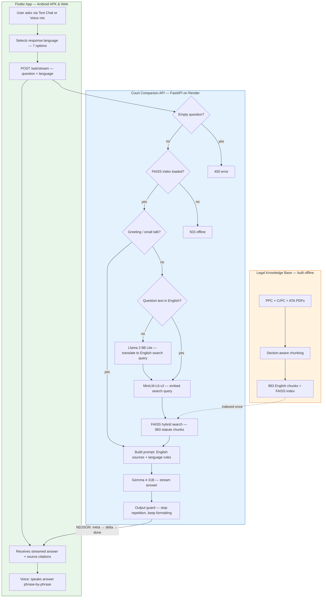
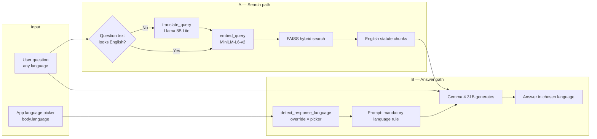

# Court Companion — How the System Works

**Language, translation & full request flow** — for Devpost, README, and technical review.

Court Companion uses **two separate language pipelines** that must not be confused:

| Pipeline | Purpose | When it runs |
|----------|---------|--------------|
| **A — Search translation** | Turn the user's question into **English** so FAISS can find the right statute chunks | Before retrieval |
| **B — Response language** | Tell the LLM which language to **write the answer in** | During generation |

The knowledge base (embeddings + FAISS index) is **English-only**.  
The user's answer can still be in **any of 7 languages**.

### Copy this paragraph (Devpost / submission)

```
Court Companion is an AI-powered multilingual legal assistant that helps Pakistani citizens understand their rights, FIR procedures, bail, and criminal laws (PPC, CrPC, ATA) in plain language. Built with Flutter for Android and Web, users can ask questions by text or voice in seven languages — English, Urdu, Roman Urdu, Pashto, Punjabi, Sindhi, and Balochi. Behind the app, a FastAPI backend on Render uses Retrieval-Augmented Generation (RAG): non-English questions are translated to English for search across 983 indexed statute chunks, then Gemma 4 explains the retrieved legal sources in the user's chosen language with live streaming and source citations. Court Companion does not replace a lawyer — it makes trustworthy legal information accessible when people need it most.
```

---

## How the System Works

Court Companion is a **Retrieval-Augmented Generation (RAG)** legal assistant. When a citizen asks a question, the app does not rely on the LLM's memory alone — it **finds real PPC / CrPC / ATA text first**, then explains it in plain language.

### System diagram (copy to Devpost)



### Step-by-step (what happens when you ask a question)

| Step | Layer | What happens |
|------|-------|--------------|
| **1** | User | Types a question or speaks into the mic (voice → speech-to-text). |
| **2** | Flutter | User picks **response language** (Urdu, English, Pashto, etc.). |
| **3** | Flutter | Sends `POST /ask/stream` with `{ question, language }` to Render. |
| **4** | API | Validates request; checks FAISS index and Together.ai API key. |
| **5** | API | **IF** greeting/small talk → skip search, LLM replies briefly. **ELSE** → legal RAG path. |
| **6** | API | **IF** question is not English → **Llama 8B** translates it to an English search query. |
| **7** | API | Embeds the English query → **FAISS** retrieves top PPC/CrPC/ATA chunks (hybrid keyword + vector). |
| **8** | API | Builds prompt: English statute text + **mandatory answer-language rule** from app picker. |
| **9** | API | **Gemma 4 31B** streams the answer token-by-token in the user's chosen language. |
| **10** | Flutter | Shows live text, source chips, disclaimer; voice mode speaks each sentence as it arrives. |

### Devpost summary (paste-ready)

> **Court Companion** helps Pakistani citizens understand criminal law in **7 languages**. Users ask by **text or voice**; the Flutter app calls a **FastAPI + RAG backend** on Render. Non-English questions are **translated to English for search** (English-only FAISS index over **983 PPC/CrPC/ATA chunks**), then **Gemma 4** explains the retrieved statutes in the user's **chosen response language** — grounded, cited, and streamed in real time.

### Three layers at a glance

| Layer | Technology | Role |
|-------|------------|------|
| **Client** | Flutter (APK + Web) | Chat UI, voice mic/TTS, language picker, streaming display |
| **API** | FastAPI + Together.ai | Intent detection, translation, RAG retrieval, LLM generation |
| **Knowledge** | FAISS + sentence-transformers | 983 section-aware chunks from PPC, CrPC, ATA |

---

## Why English-only embeddings?

| Component | Language | File |
|-----------|----------|------|
| Legal PDFs | English statute text | `data/*.pdf` |
| Chunked text | English | `backend/rag/index/chunks.json` |
| Embedding model | `all-MiniLM-L6-v2` (English-trained) | `backend/rag/embedder.py` |
| FAISS vectors | Built from English chunks | `backend/rag/index/index.faiss` |

If you embed an Urdu question directly, similarity scores against English statute text are **weak or wrong**.  
So we **translate the question to English for search only**, then let the LLM **read English sources** and **reply in the user's language**.

---

## Language pipelines (detail)

The master diagram above includes both language paths. Here is how **search translation** and **response language** split inside the API.



**Key point:** The **original question** (Urdu, Pashto, etc.) is still sent to the answer LLM.  
Only the **search string** is translated.

---

## Pipeline A — Search translation (before FAISS)

### Where it happens

`backend/main.py` (and `/analyze-document` for legal questions):

```python
search_query = question
if detect_response_language(question) != "english":
    search_query = generator.translate_query(question)

chunks = retriever.retrieve(search_query)
```

### Gate: when is translation triggered?

Uses `detect_response_language(question)` **without** the app picker — it looks at **question text only**.

```
IF detect_response_language(question) == "english":
    search_query = question          # use as-is
ELSE:
    search_query = translate_query(question)   # LLM → English
```

So:

- Urdu question `"چوری کی سزا کیا ہے؟"` → **translate** before search  
- English question `"What is the punishment for theft?"` → **no** translation  
- Roman Urdu `"chori ki saza kya hai"` → **translate** (detected as roman_urdu, not english)

### What `translate_query()` does

**Model:** `meta-llama/Meta-Llama-3-8B-Instruct-Lite` (Together.ai)  
**File:** `backend/rag/generator.py`

| Setting | Value |
|---------|-------|
| `temperature` | `0.0` (deterministic) |
| `max_tokens` | `250` |
| Output | English search phrase only — no explanation |

**System prompt tells the model to:**

- Output **only** the English translation  
- Keep legal terms: FIR, bail, PPC, CrPC  
- Preserve **every** legal topic (offence + procedure + section numbers)  
- If FIR / ایف آئی آر appears → translation **must** contain `"FIR"`

**Example:**

| Input (Urdu) | `search_query` (English) |
|--------------|--------------------------|
| `چوری کی سزا کیا ہے؟` | `punishment for theft under Pakistan Penal Code section 379` |
| `FIR kese darj hoti hai?` | `how to register an FIR under CrPC section 154` |
| `302 ki saza kya hai?` | `punishment for murder PPC section 302` |

### Fallback

```python
except Exception:
    return question   # use original if API fails
```

If translation fails, retrieval runs on the raw question (weaker for non-English, but the app does not crash).

### After translation: embedding + search

```python
# embedder.py
vector = SentenceTransformer("all-MiniLM-L6-v2").encode([search_query])
# retriever.py — hybrid FAISS + keyword re-ranking
chunks = retriever.retrieve(search_query)
```

Retrieved chunks are **English statute text** (PPC / CrPC / ATA).  
They are passed to the answer LLM as `[Source 1: penal, Section 379] ...`.

---

## Pipeline B — Response language (answer generation)

### Where the language code comes from

**Flutter** sends `language` on every request:

```json
{ "question": "...", "language": "urdu_script" }
```

**Default:** `urdu_script` (`kDefaultLanguage` in `language_picker.dart`)

**Backend** validates:

```python
# main.py
lang = _language_override(body.language)

def _language_override(value):
    if value in SUPPORTED_LANGUAGES:
        return value
    return "urdu_script"   # default
```

The app picker is **authoritative** for the answer language.

### How the LLM is forced to reply in that language

`generator.py` → `_rag_messages()`:

```python
lang = detect_response_language(question, override=language)
lang_rule = language_system_rule(lang)
```

Here `override=language` is the **app picker**. It **always wins** when valid.

#### `detect_response_language()` decision tree

**File:** `backend/rag/language.py`

```
IF override is in SUPPORTED_LANGUAGES:
    RETURN override                    ← app picker wins (normal case)

IF question is empty:
    RETURN "english"

IF 3+ Arabic-script characters (U+0600–U+06FF):
    IF 2+ Sindhi-specific letters → RETURN "sindhi"
    ELIF 2+ Pashto-specific letters → RETURN "pashto"
    ELSE → RETURN "urdu_script"        ← Punjabi/Balochi default here

ELSE (mostly Latin letters):
    Count keyword hits: punjabi, pashto, sindhi, roman_urdu
    IF best_hits >= 2 AND best_hits >= max(english_words * 0.15, 1):
        IF regional lang BUT roman_urdu within 2 hits → RETURN "roman_urdu"
        ELSE → RETURN best regional language
    ELSE → RETURN "english"
```

**Supported codes:**

| Code | Answer form |
|------|-------------|
| `english` | English |
| `urdu_script` | Urdu in Arabic script (اردو) |
| `roman_urdu` | Roman Urdu (Latin letters) |
| `pashto` | Pashto script (پښتو) |
| `punjabi` | Shahmukhi (پنجابی) |
| `sindhi` | Sindhi script (سنڌي) |
| `balochi` | Balochi Arabic script (بلوچی) |

> **Note:** Punjabi and Balochi in Arabic script look like Urdu. Users should **select them in the app picker** for guaranteed output. Auto-detect may label them as `urdu_script`.

### Prompt injection (how the LLM “knows” the target language)

Two strings are appended to every legal answer prompt:

**1. System rule** (`language_system_rule`):

```
MANDATORY LANGUAGE FOR THIS REPLY: URDU SCRIPT (اردو) ONLY.
Write the ENTIRE answer (including the disclaimer) in this language.
Never mix languages...
```

**2. User message note** (`language_instruction`):

```
IMPORTANT: Jawab sirf Urdu script (اردو) mein likhein.
English ya Roman Urdu bilkul na likhein.
```

The **original question** (still in Urdu/English/etc.) is also in the user message.  
The **retrieved context** is in English.  
Gemma 4 31B is instructed to **explain English sources in the mandated language**.

There is **no second translation step** for the answer — the main LLM writes directly in the target language.

---

## The two pipelines can disagree (by design)

This is intentional and important.

| User picks | User types | Search path | Answer path |
|------------|------------|-------------|-------------|
| Urdu | English: `"What is FIR?"` | No translation (question is English) | Answer in **Urdu** (picker) |
| English | Urdu: `"چوری کی سزا?"` | **Translate** to English for FAISS | Answer in **English** (picker) |
| Urdu | Urdu: `"ضمانت کیسے ملتی ہے?"` | **Translate** for FAISS | Answer in **Urdu** (picker) |
| Pashto | Pashto script question | **Translate** for FAISS | Answer in **Pashto** (picker) |

**Search** follows **question text**.  
**Answer** follows **app picker**.

---

## Worked example (full trace)

**User:** selects **Urdu** in app  
**Question:** `ایف آئی آر کس طرح درج ہوتی ہے؟`

### Step 1 — API receives

```json
{ "question": "ایف آئی آر کس طرح درج ہوتی ہے؟", "language": "urdu_script" }
```

### Step 2 — Response language locked

```python
lang = "urdu_script"   # from body.language
```

### Step 3 — Search gate

```python
detect_response_language(question)  # no override
→ "urdu_script" ≠ "english"
→ translate_query(question)
```

**Llama 8B Lite output (example):**

`How to register an FIR under CrPC section 154 first information report`

### Step 4 — Retrieval

```
embed_query(english_search_string)
→ FAISS finds CrPC §154 chunks + related procedure text
```

### Step 5 — LLM prompt built

```
[System]
  SYSTEM_PROMPT + [Source 1: criminal_procedure, Section 154] + English statute text...
  MANDATORY LANGUAGE: URDU SCRIPT (اردو) ONLY

[User]
  ایف آئی آر کس طرح درج ہوتی ہے؟
  IMPORTANT: Jawab sirf Urdu script mein likhein...
```

### Step 6 — Streamed answer

Urdu explanation of FIR registration, citing section 154, with Urdu disclaimer.

**At no point is the answer machine-translated from English.**  
The LLM **generates** Urdu from English sources + Urdu instructions.

---

## Voice mode (language difference)

| Setting | Value |
|---------|-------|
| Voice picker | English only (`kVoiceEnabledLanguages`) |
| `language` sent to API | `"english"` |
| STT locale | `en_US` |

Search and answer both treat the spoken question as English if STT outputs English text.  
Multilingual voice (STT + TTS for all 7 languages) is **planned**.

---

## Models summary

| Step | Model | Role |
|------|-------|------|
| Search translation | `Meta-Llama-3-8B-Instruct-Lite` | Question → English search query |
| Embeddings | `all-MiniLM-L6-v2` | English query → vector |
| Answer generation | `google/gemma-4-31B-it` | English sources + rules → answer in target language |

---

## What we do NOT do (yet)

| Not implemented | Current behaviour |
|-----------------|-------------------|
| Multilingual embeddings | All search vectors are English-space |
| Answer post-translation | No “generate English then translate to Urdu” |
| Per-language FAISS indexes | Single English index only |
| Chat history in prompts | Each request is stateless |
| Auto picker from question | Picker is manual; backend auto-detect is backup when override missing |

---

## Source files

| Topic | File |
|-------|------|
| Search translation gate | `backend/main.py` |
| `translate_query()` | `backend/rag/generator.py` |
| Response language detect + rules | `backend/rag/language.py` |
| Prompt language policy | `backend/rag/prompts.py` |
| Embeddings | `backend/rag/embedder.py` |
| FAISS retrieval | `backend/rag/retriever.py` |
| App language picker | `Frontend/lib/widgets/language_picker.dart` |
| API `language` field | `Frontend/lib/services/api_service.dart` |
| Translation model config | `backend/config.py` → `translation_model` |

---

## Related docs

- [../README.md](../README.md) — project overview  
- [ARCHITECTURE.md](ARCHITECTURE.md) — full system design  
- [../SUBMISSION_SCREENING.md](../SUBMISSION_SCREENING.md) — hackathon submission details

---

## Devpost tips

- Paste the **System diagram** mermaid block into your Devpost project description (Devpost supports Markdown).
- If the diagram does not render, export `assets/images/Cover.png` as your hero image and link to this file on GitHub for the full diagram.
- Use the **Devpost summary** paragraph above as your “How it works” blurb.
