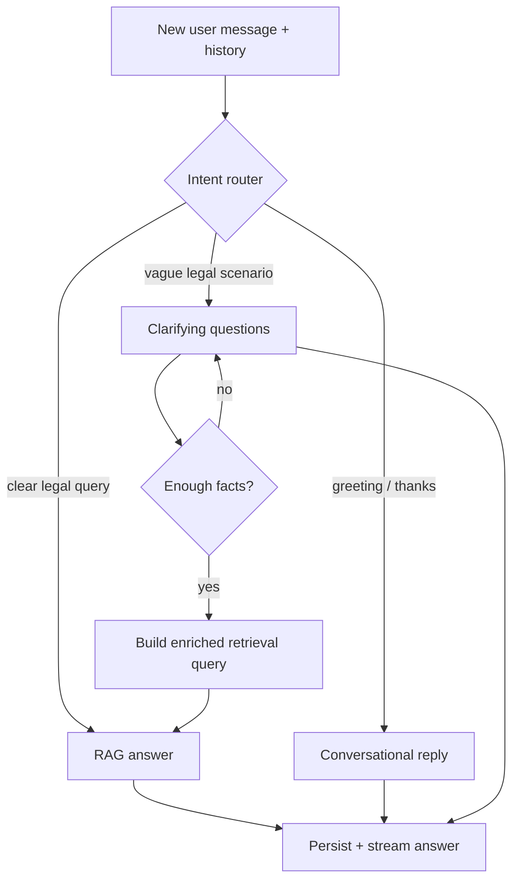

# Court Companion — Product Modules (Design)

**Product:** Court Companion  
**Version:** 0.4 (Planning)  
**Last updated:** 2026-06-17  
**Status:** Partially implemented (citizen chat history); Pro module planned separately

This document plans **post-MVP platform modules** for Court Companion. Each module has its own sections below; shared infrastructure (especially **Supabase**) is designed once and reused.

| Module | Priority | One-line goal |
|--------|----------|---------------|
| **1 — Smarter Conversations** | P0 | Multi-turn scenario reasoning — **no login**; history on this phone only |
| **2 — Admin Dashboard** | P1 | Feedback + analytics to prove civic impact with data |
| **3 — Court Companion Pro** | P1 (paid) | Professional case workspace for lawyers — see [`COURT_COMPANION_PRO.md`](./COURT_COMPANION_PRO.md) |

**Shared stack:** Supabase PostgreSQL · FastAPI orchestration · Flutter client(s)

---

# Module 1 — Smarter Conversations

## 0. Product Vision — Not a Generic Chatbot

Court Companion is **not** a definitions-only bot (“What is an FIR?”, “Why is bail important?”). Those questions are supported, but the core product value is **scenario reasoning**:

> A citizen describes a **real, messy situation** — multiple facts, conflicting claims, time pressure, and an **actual decision to make**. The assistant walks through it properly: identifies which laws may apply, explains the relevant **CrPC procedure**, separates **disputed vs established facts**, and lays out the person’s **rights and practical next steps** — grounded in retrieved PPC / CrPC / ATA text.

### What “scenario reasoning” means here

| Generic chatbot | Court Companion (target) |
|-----------------|--------------------------|
| Answers one isolated question | Holds **multi-turn context** across a case narrative |
| “Section 379 is theft” | “Given snatching + force, **379 vs 356/392** may apply — here is why and what to tell police” |
| Ignores conflicting stories | **Acknowledges disputes** (“police say X, neighbour says Y”) and explains what each side affects procedurally |
| No action path | **Numbered next steps**: FIR, bail application, magistrate, legal aid |
| Stateless | **Remembers** prior facts from the same conversation |

### Example scenario types (already in demo script)

1. **Shop break-in + delayed FIR** — cognizable offence, police refusal, ₹150k value, which PPC sections, CrPC complaint procedure  
2. **Arrest at night + bail** — illegal detention risk, 24-hour magistrate rule, bail categories under CrPC  
3. **§302 accusation + self-defence claim** — qatl-i-amd vs murder concepts, bail **not automatic** in 302, what facts courts weigh  

Smarter conversations (history + agentic follow-ups) exist to **power this scenario engine**, not to make small talk better.

---

## 1. Summary

Court Companion today answers **one question at a time**. Each `/ask` and `/ask/stream` call receives a single `question` string with no memory of prior turns. That works for direct queries (“What is an FIR?”) but fails for:

- Follow-ups (“What about bail?” after an arrest narrative)
- Vague openers (“someone took my phone”)
- **Multi-paragraph scenarios** where law, procedure, and rights must be reasoned together

This document defines capabilities to close that gap:

| # | Feature | Goal |
|---|---------|------|
| **A** | **Chat history & context** | Preserve the full case narrative across turns |
| **B** | **Agentic follow-ups** | Gather missing facts before citing the wrong PPC section |
| **C** | **Scenario reasoning pipeline** | Multi-step analysis: facts → applicable law → procedure → rights → next steps |

**Database:** Use **Supabase (PostgreSQL)** for durable conversation storage. The FastAPI backend remains the orchestration layer; Supabase is not called directly from the Flutter app for chat logic.

---

## 2. Current State (Baseline)

### 2.1 What exists today

| Layer | Behavior |
|-------|----------|
| **Flutter home** | Three entries: **Ask in chat** · **Ask by voice** · **Court Companion Pro** (beta info). No separate “Analyze document” home button — attach PDF/TXT inside chat only |
| **Flutter chat** | In-memory + local/session store; **fresh chat** when opening from home; sidebar lists past conversations; follow-up works **within same chat session** |
| **API** | `POST /ask/stream` — body: `{ question, language, voice_mode, device_id, conversation_id }` |
| **Backend** | RAG + optional Supabase persistence per `device_id` |
| **Intent** | `is_conversational_query()` vs `is_legal_query()` in `rag/query_intent.py` |
| **Query hints** | Topic expansion in `rag/query_analysis.py` (FIR, bail, theft, etc.) |
| **Agentic clarifying** | **Not in citizen chat yet** — planned for **Court Companion Pro** ([`COURT_COMPANION_PRO.md`](./COURT_COMPANION_PRO.md)) |

### 2.2 Gaps

1. **No `conversation_id` or `session_id`** — backend cannot link turns of one case.
2. **No message history in LLM calls** — generator sends only the latest user message (+ system prompt + RAG context).
3. **No triage step** — vague or partial scenarios immediately trigger retrieval → wrong or generic sections.
4. **No structured scenario pass** — messy multi-fact inputs are not decomposed into facts / law / procedure / rights / steps.
5. **Voice screen** — same limitation; each utterance is isolated.

### 2.3 Design principles (carry forward)

- Answers remain **grounded in retrieved PPC/CrPC/ATA text** — reasoning explains statutes; it does not invent them.
- **Legal information only** — clarify facts, explain options and procedure; do not tell user they will win or are guilty.
- **Scenario-first** — prefer structured walkthroughs over one-line definitions when user describes a situation.
- **Handle uncertainty** — when facts conflict or are missing, say what **depends** on which fact pattern.
- **Multilingual** — clarifying questions, reasoning, and steps respect the user’s selected reply language.
- **Privacy-first** — conversations may contain sensitive criminal situations; minimize retention and allow deletion.
- **No login for citizens** — history belongs to **this phone only**; no accounts, passwords, or logout (see §2.4).

### 2.4 Citizen access — no login, device-only history

Many users are **not familiar with login, logout, email, or passwords**. Court Companion must work for them without any account UI.

#### What the user experiences

| They do | What happens |
|---------|----------------|
| Open **Ask in chat** from home | **New empty chat** (suggestion chips). Past threads appear in **sidebar** — tap to reopen |
| Ask more questions in the **same** chat session | Conversation continues; `conversation_id` sent to backend for follow-up context |
| Tap **New chat** in sidebar | Fresh thread; previous one saved in history list |
| Tap a **past chat** in sidebar | Loads that conversation |
| Go **back to home** and open chat again | **New empty chat** (not the last active window) |
| Tap **Court Companion Pro** on home | Beta **info screen** only — professional workspace coming later |
| Use another family member’s phone | They see **that phone’s** chats only — not theirs |
| Uninstall app | Local history gone unless server copy existed for that `device_id` |

**No screens for:** Sign up · Log in · Log out · Forgot password · Profile

#### How it works technically (device = identity)

```
┌─────────────────────────────────────────────────────────┐
│  THIS PHONE                                             │
│  ┌─────────────────────┐    ┌────────────────────────┐ │
│  │ Local chat storage  │    │ device_id (random UUID) │ │
│  │ (Hive / SQLite)     │    │ created once on install │ │
│  │ PRIMARY for UI      │    │ invisible to user       │ │
│  └──────────┬──────────┘    └───────────┬────────────┘ │
│             │                            │              │
│             └────────────┬───────────────┘              │
│                          │ when online                  │
└──────────────────────────┼──────────────────────────────┘
                           ▼
                    FastAPI → Supabase
                    (rows keyed by device_id)
```

| Layer | Role |
|-------|------|
| **On-device storage** | Source of truth for what user **sees** — fast, works offline for reading old messages |
| **`device_id`** | Anonymous random ID generated on first launch — **not** a login; user never types it |
| **Supabase (optional sync)** | When online, copies messages server-side keyed by `device_id` so backend can load **LLM context** and admin can count usage — not for citizen “accounts” |

**Device-to-device isolation:** Phone A’s `device_id` ≠ Phone B’s. Server only returns conversations where `device_id` matches the request. Citizen A never sees Citizen B’s history.

#### Why not login?

| Login-based | Device-based (our choice) |
|-------------|---------------------------|
| Needs email/phone OTP | Zero literacy barrier |
| “Logout” confuses users | Close app = done |
| Shared phone risk if logged in | Each install = separate history |
| Forgot password support | No passwords |

**Admin dashboard** is the only place with a password — organizers/analysts, not citizens.

#### Optional later (not MVP)

- **Cloud backup** toggle in Settings (Urdu): “Dusre phone par purani guftagu” — only if user explicitly opts in
- NGO kiosk mode: shared tablet with “Start as new person” button between users

#### Flutter implementation notes

| Piece | Choice |
|-------|--------|
| Local DB | `hive` or `drift` — store `ChatMessage` list + conversation metadata |
| `device_id` | `uuid` → `shared_preferences` / `flutter_secure_storage` on first launch |
| Restore on open | Read local DB first; if empty and online, `GET /conversations?device_id=` |
| Copy | **Avoid** “session”, “account”, “sync” — use **“apni guftagu”** (your conversation) |

#### Simple UI labels (Urdu + English)

| Action | Urdu (primary) | English |
|--------|----------------|---------|
| New chat | نئی گفتگو | New chat |
| Past chats | پچھلی گفتگو | Previous chats |
| Clear all | گفتگو مٹائیں | Clear chats |
| Confirm clear | کیا آپ واقعی مٹانا چاہتے ہیں؟ | Delete all messages on this phone? |

---

## 3. Feature A — Chat History & Context

### 3.1 User stories

| ID | Story |
|----|-------|
| H1 | As a user, when I ask “How do I get bail?” after discussing arrest, the assistant remembers I was arrested yesterday. |
| H2 | As a user, when I open the app again on **the same phone**, I see my previous messages — **no login**. |
| H3 | As a user, I can start a **new conversation** with one tap (“Nayi guftagu”) without understanding accounts. |
| H4 | As a user, my follow-up “Section 379?” is understood as continuing the theft discussion. |
| H5 | As a user, I can paste a **long scenario** (many facts) and get a structured legal walkthrough, not a generic paragraph. |
| H6 | As a user, when two versions of events conflict, the assistant explains **what each version affects** procedurally. |
| H7 | As a user on a **shared family phone**, I only see chats from **this app install**; I am never asked to log in or out. |
| H8 | As a user, I can **clear all chats** on my phone with a simple confirm — no account settings. |

### 3.2 Conversation model

```
Conversation (per device)
  ├── id (uuid)
  ├── device_id (anonymous — this phone only, not a user account)
  ├── language (default reply language)
  ├── status (active | archived)
  ├── created_at, updated_at
  └── Messages[]
        ├── id (uuid)
        ├── role (user | assistant | system)
        ├── content (text)
        ├── metadata (json: sources, phase, clarifying_questions, etc.)
        └── created_at

Local mirror (Flutter Hive/SQLite)
  └── Same messages — shown in UI even when offline
```

**Scope for MVP+1:**

- **Local-first:** Messages saved on device immediately; user always sees history on reopen.
- **Server copy:** When online, sync to Supabase by `device_id` for multi-turn LLM context.
- One **active** thread or a simple **previous chats** list (last 5 conversations).
- Send last **N turns** to the LLM (recommend **6–10 messages** / ~2–3k tokens cap).
- Older turns summarized optionally in Phase 2 (see §6).

### 3.3 Context assembly (backend)

For each new user message:

1. Load conversation history from Supabase (ordered by `created_at`).
2. Build **retrieval query** from:
   - latest user message, **plus**
   - compressed context from prior turns (see §4.3 `case_summary`).
3. Pass **message list** to LLM:

```python
messages = [
  {"role": "system", "content": system_prompt + rag_context},
  # last N history turns (user/assistant only)
  {"role": "user", "content": "..."},
  {"role": "assistant", "content": "..."},
  {"role": "user", "content": current_question},
]
```

4. Persist user message and assistant reply to Supabase after stream completes.

### 3.4 API changes

**Extend request body:**

```json
{
  "question": "What about bail?",
  "language": "urdu_script",
  "voice_mode": false,
  "conversation_id": "550e8400-e29b-41d4-a716-446655440000"
}
```

**New endpoints (optional REST shape):**

| Method | Path | Purpose |
|--------|------|---------|
| `POST` | `/conversations` | Create conversation; returns `conversation_id` (requires `device_id`) |
| `GET` | `/conversations` | List conversations for **this device only** (`?device_id=`) |
| `GET` | `/conversations/{id}` | Load messages (validates `device_id` owns conversation) |
| `DELETE` | `/conversations/{id}` | Clear history for this device |
| `POST` | `/ask/stream` | Extended — accepts `conversation_id` + `device_id` |

**Stream meta event extension:**

```json
{
  "type": "meta",
  "conversation_id": "...",
  "message_id": "...",
  "phase": "clarifying | reasoning | answering | conversational",
  "sources": [],
  "disclaimer": "..."
}
```

### 3.5 Flutter changes

| Change | Detail |
|--------|--------|
| **Local chat store** | `hive` / `drift` — primary UI history on device |
| `device_id` | Auto-generated on first launch — **never shown to user** |
| Persist `conversation_id` | Local + optional server sync |
| Restore on open | Load local DB → if empty, fetch from API by `device_id` |
| **“Nayi guftagu”** | New chat — no login language |
| **“Guftagu mita dein”** | Clears local + server history for this device |
| Send `device_id` | All API calls — backend enforces device isolation |
| Voice screen | Same device store + conversation id |

---

## 4. Feature B — Agentic Follow-ups

> **Scope note (2026-06-17):** Agentic clarifying questions (AI asks the user for missing facts before citing law) are **not** implemented in free **Ask in chat**. They are planned as the core of **Court Companion Pro** for lawyers — see [`COURT_COMPANION_PRO.md`](./COURT_COMPANION_PRO.md). Citizen chat supports **user-initiated** follow-ups in the same session (e.g. “What about bail?” after an FIR question).

### 4.1 Problem

Citizens often describe **situations**, not legal questions:

> “Someone took my phone.”  
> “Police picked me up last night.”  
> “My neighbour hit me.”

Immediate RAG on these short utterances retrieves weak matches. The assistant should **clarify the scenario** before citing PPC sections.

### 4.2 Desired behavior (example)

**Turn 1 — User:**  
`Someone took my phone.`

**Turn 1 — Assistant (clarifying, no sources yet):**  
```
I can help you understand which offence may apply under Pakistani law.
To point you to the right PPC section, please tell me:

1. Was your phone taken without your permission while you were not present (e.g. pickpocketing), or did someone take it from you directly?
2. Was any force, threat, or injury involved?
3. Do you know the person, or was it a stranger?

Once you answer, I will explain the relevant law and practical next steps (such as FIR under CrPC).
```

**Turn 2 — User:**  
`A stranger snatched it from my hand on the street.`

**Turn 2 — Assistant (RAG answer with sources):**  
- Retrieval query expanded: `theft snatching robbery section 379 356 PPC street`
- Answer cites **PPC §379** (theft) and possibly **§356/§392** (robbery/dacoity) depending on facts
- Sources from FAISS as today

### 4.3 Orchestration pipeline

Replace the current binary path (`conversational` vs `legal → RAG`) with a **three-phase router**:



#### Phase detection rules (deterministic + LLM)

**Skip clarifying (go straight to RAG)** when any of:

- User cites a section number (`302`, `Section 379`)
- Query matches strong legal triggers + sufficient detail (≥15 words or multiple facts)
- Follow-up turn in same conversation after clarifying phase already completed
- User explicitly asks a procedural question (“How to file FIR?”)

**Enter clarifying phase** when:

- `is_legal_query()` is true **but** `needs_clarification()` is true
- Vague theft/hurt/arrest/fraud patterns with **few facts**

**`needs_clarification()` heuristic (v1):**

```python
VAGUE_LEGAL_PATTERNS = [
  (r"\b(took|stolen|lost|snatch|chori|phone|wallet)\b", "theft"),
  (r"\b(hit|beat|mar|injur|hurt|assault)\b", "hurt"),
  (r"\b(arrest|police|girftari|thana)\b", "arrest"),
  (r"\b(cheat|fraud|dhoka|scam)\b", "fraud"),
]

def needs_clarification(query: str, history: list) -> bool:
    if already_clarified_in_history(history):
        return False
    if word_count(query) >= 20 and count_facts(query) >= 2:
        return False
    return matches_vague_pattern(query)
```

LLM router (Phase 2) can replace heuristics with a structured JSON classifier.

#### Clarifying prompt (new)

System prompt addition — **Clarifying Agent**:

- Ask **1–3 short questions**, numbered
- No section citations yet
- No definitive “you were robbed” — use “which may apply”
- Same language as user selection
- Store `phase: "clarifying"` in message metadata

#### Case summary for retrieval

Before RAG, merge clarifying answers into one **retrieval query**:

```
Original: "Someone took my phone"
+ Follow-ups: "stranger, snatched from hand, on street"
→ search_query: "theft snatching mobile phone stranger force section 379 356 PPC Pakistan"
```

Implement via:

1. **Rule-based merge** (v1): concatenate user turns in conversation since last assistant clarifying block
2. **LLM summary** (v2): one-sentence `case_summary` field stored in conversation metadata

### 4.4 Scenario playbooks (v1)

Pre-defined clarifying question templates by topic — faster and more consistent than pure LLM.

| Topic | Trigger examples | Clarifying questions |
|-------|------------------|----------------------|
| **Theft / property** | phone, wallet, chori, stolen | Force involved? Known person? Location/time? Value approximate? |
| **Hurt / assault** | hit, mar peet, injury | Weapon used? Medical treatment? Relationship to attacker? |
| **Arrest / custody** | police, girftari | Arrested or only questioned? Warrant shown? How long held? |
| **Fraud / cheating** | scam, dhoka, 420 | Money/property lost? Written agreement? Online or in person? |
| **FIR procedure** | register case | Cognizable offence already occurred? Which police station? |

Store playbooks in `backend/rag/clarifying_playbooks.py` (config, not DB).

### 4.5 Stream UX signals

Frontend uses `meta.phase`:

| `phase` | UI |
|---------|-----|
| `clarifying` | No source chips; subtle badge “Gathering details” |
| `answering` | Normal source chips + disclaimer |

Voice mode: clarifying replies should be **shorter** (2 questions max, TTS-friendly).

---

## 4.6 Feature C — Scenario Reasoning Pipeline

When the user provides enough facts (in one message or across turns), the assistant produces a **structured legal walkthrough**, not a FAQ snippet.

### 4.6.1 Response structure (mandatory for scenarios)

For scenario-level queries, answers follow this order (aligned with `backend/rag/prompts.py`):

| Step | Section | Purpose |
|------|---------|---------|
| 1 | **Situation understood** | Brief restatement of key facts in plain language |
| 2 | **What may apply (PPC)** | Offences/sections supported by retrieved context — note if **alternative sections** possible |
| 3 | **Procedure (CrPC)** | FIR, investigation, arrest, remand, bail pathway as relevant |
| 4 | **Your rights** | Custody limits, complaint rights, bail eligibility framing |
| 5 | **Practical next steps** | Numbered actions the citizen can take now |
| 6 | **If facts are disputed** | What changes if side A vs side B is true (conflicting claims) |
| 7 | **Disclaimer** | Legal information only |

**Word budget:** 250–450 words for complex scenarios (voice mode: compress to 80–160 words but keep steps).

### 4.6.2 Worked example — shop theft + police delay (single turn)

**User input (messy, multi-fact):**

> Shop broken into at night in Lahore. Cash + laptop stolen (~₹150,000). Police say investigate first before FIR. Someone else says theft is cognizable and FIR must be recorded. Which PPC section? What CrPC procedure?

**Expected assistant behavior:**

1. **Restate** facts (break-in, theft, value band, police response).
2. **PPC:** Discuss theft-related sections from retrieved chunks (e.g. §379 area); mention burglary/break-in concepts **only if in context**.
3. **CrPC:** §154 FIR on cognizable offences; citizen’s right to report; what to do if station refuses (superintendent, complaint under §154(3) area if in corpus).
4. **Rights:** Do not promise FIR will be registered instantly; explain legal information on cognizable vs procedure.
5. **Steps:** Document loss, visit PS, written complaint, escalate if refused, consult lawyer.
6. **Conflict:** Explain why police may say “investigate first” vs citizen expectation of immediate FIR — both framed as information, not taking police side.
7. **Sources:** Cite retrieved PPC + CrPC chunks.

### 4.6.3 Worked example — §302 + self-defence (conflicting claims)

**User input:**

> Accused under §302. Claims self-defence during night robbery. Complainant says murder. No prior record. Family’s only earner. Can bail be considered?

**Expected behavior:**

- Separate **substantive** (PPC — qatl-i-amd / murder concepts from context) from **procedural** (CrPC bail — not automatic in 302; court discretion).
- State that **self-defence vs murder** is fact-dependent for courts; assistant explains legal **framework** only.
- Next steps: legal counsel, bail application pathway, document family hardship as context for lawyer (not as legal conclusion).

### 4.6.4 Scenario detection

Route to **full scenario pipeline** when:

- Message length ≥ ~40 words **or** ≥ 3 distinct fact clauses **or**
- History + current message together describe an incident + decision **or**
- User asks “what should I do” / “mera kya banega” / “can I get bail” inside a narrative

Route to **clarifying** when scenario intent is clear but **critical facts missing** (see §4.1–4.4).

Route to **short RAG** when simple definitional (“What is FIR?”).

### 4.6.5 Backend modules (planned)

| Module | Role |
|--------|------|
| `rag/scenario_router.py` | Classify: definitional / clarifying / full scenario |
| `rag/scenario_analysis.py` | Extract `case_facts`, `open_questions`, `conflicting_claims` |
| `rag/clarifying_playbooks.py` | Topic-specific follow-up templates |
| `rag/generator.py` | `generate_scenario_answer(history, chunks, analysis, language)` |

**`case_facts` JSON (stored in conversation metadata):**

```json
{
  "incident_type": "theft",
  "location": "Lahore",
  "value_pkr": 150000,
  "parties": { "user_role": "complainant" },
  "conflicts": [
    { "topic": "fir_timing", "claim_a": "police investigate first", "claim_b": "FIR must be immediate" }
  ],
  "open_questions": ["force_used", "identification_of_suspect"]
}
```

### 4.6.6 Retrieval for scenarios

Multi-query retrieval (v2):

1. Primary query from `case_summary`
2. Secondary queries per detected topic (theft → §379 chunks; procedure → §154 CrPC)
3. Merge + dedupe chunks before `build_context()`

Uses existing `query_analysis.py` hints; extend with scenario-level topic list from `case_facts`.

---

## 5. Supabase Design

### 5.1 Why Supabase

| Need | Supabase fit |
|------|----------------|
| Persist conversations | PostgreSQL tables |
| Fast hackathon setup | Hosted, free tier, SQL migrations |
| Future auth | Supabase Auth (optional Phase 3) |
| Row-level security | Restrict users to own conversations |
| Realtime (optional) | Not required for MVP |

**Alternative considered:** SQLite on device only — simpler but no cross-device sync, harder for voice+chat unified session, no server-side audit. **Rejected for multi-turn orchestration** where backend must read history.

### 5.2 Schema (SQL migration)

```sql
-- conversations
create table public.conversations (
  id uuid primary key default gen_random_uuid(),
  device_id text not null,              -- anonymous client id (Flutter)
  language text not null default 'urdu_script',
  status text not null default 'active' check (status in ('active', 'archived')),
  case_summary text,                    -- LLM/rule summary for retrieval
  case_facts jsonb default '{}'::jsonb, -- structured scenario extraction
  clarifying_complete boolean not null default false,
  created_at timestamptz not null default now(),
  updated_at timestamptz not null default now()
);

create index conversations_device_id_idx on public.conversations (device_id, updated_at desc);

-- messages
create table public.messages (
  id uuid primary key default gen_random_uuid(),
  conversation_id uuid not null references public.conversations(id) on delete cascade,
  role text not null check (role in ('user', 'assistant', 'system')),
  content text not null,
  phase text check (phase in ('clarifying', 'reasoning', 'answering', 'conversational')),
  sources jsonb default '[]'::jsonb,
  metadata jsonb default '{}'::jsonb,
  created_at timestamptz not null default now()
);

create index messages_conversation_id_idx on public.messages (conversation_id, created_at);

-- updated_at trigger
create or replace function public.set_updated_at()
returns trigger as $$
begin
  new.updated_at = now();
  return new;
end;
$$ language plpgsql;

create trigger conversations_updated_at
  before update on public.conversations
  for each row execute function public.set_updated_at();
```

### 5.3 Row Level Security (RLS)

**Phase 1 (hackathon):** Backend uses **Supabase service role key** only on FastAPI — Flutter never holds DB credentials.

```sql
alter table public.conversations enable row level security;
alter table public.messages enable row level security;

-- No public policies; all access via service role on backend
```

**Phase 3 (optional):** Supabase Auth **admin only** — citizens remain device-based, no citizen login.

### 5.4 Device isolation (security rule)

Every conversation API must enforce:

```python
if conversation.device_id != request.device_id:
    raise HTTPException(403, "Not found")
```

Citizens never receive a Supabase key — only `device_id` + `conversation_id` via FastAPI.

### 5.5 Backend integration

```
Flutter  →  FastAPI  →  Supabase (service role)
                ↓
              FAISS + LLM
```

**New Python dependency:** `supabase-py` or direct `httpx` to PostgREST.

**Env vars (backend `.env`):**

```env
SUPABASE_URL=https://xxxx.supabase.co
SUPABASE_SERVICE_ROLE_KEY=eyJ...
CONVERSATION_HISTORY_LIMIT=10
CLARIFYING_ENABLED=true
```

**New module:** `backend/conversations/store.py`

- `create_conversation(device_id, language) -> uuid`
- `get_messages(conversation_id, limit) -> list`
- `append_message(conversation_id, role, content, phase, sources, metadata)`
- `update_conversation(conversation_id, case_summary, clarifying_complete)`

### 5.6 Data retention & privacy

| Policy | Recommendation |
|--------|----------------|
| Retention | Auto-archive conversations older than **90 days** |
| Deletion | “Guftagu mita dein” clears **local DB** + `DELETE /conversations` on server |
| PII | No name, CNIC, phone, or email — **device_id only** |
| Cross-phone | History **does not** follow user to a new phone (by design for MVP) |
| Logging | Do not log full message content in Render logs |
| Export | Out of scope for MVP |

---

## 6. Implementation Phases

### Phase 1 — Backend context (no clarifying yet)

**Effort:** ~2–3 days

- [ ] Supabase project + migration
- [ ] `conversation_id` on `/ask/stream`
- [ ] Load last N messages; pass to generator
- [ ] Persist user + assistant messages
- [ ] Flutter: **local Hive store** + auto `device_id`, restore on open, “Nayi guftagu”, “Guftagu mita dein”

**Acceptance:** User asks “What is FIR?” then “What documents do I need?” — second answer references FIR context.

### Phase 2 — Agentic follow-ups + scenario router

**Effort:** ~2–3 days

- [ ] `needs_clarification()` + playbooks
- [ ] Clarifying generator (no RAG, no sources)
- [ ] `scenario_router.py`: definitional vs clarifying vs full scenario
- [ ] `clarifying_complete` flag on conversation
- [ ] Enriched retrieval query from multi-turn text
- [ ] Flutter `meta.phase` UI

**Acceptance:** “Someone took my phone” → clarifying questions → user answers → PPC sections cited with sources.

### Phase 3 — Scenario reasoning (multi-step answers)

**Effort:** ~3–4 days

- [ ] `scenario_analysis.py` — extract `case_facts`, conflicts, open questions
- [ ] Structured answer template in prompts (facts → law → procedure → rights → steps)
- [ ] Multi-query retrieval for complex scenarios
- [ ] Demo scenarios pass: shop theft + FIR delay, arrest + bail, §302 + self-defence claim
- [ ] `case_facts` persisted on conversation row

**Acceptance:** Long messy scenario in one message → structured walkthrough with sources, conflicting claims addressed, numbered next steps.

### Phase 4 — Polish

**Effort:** ~2 days

- [ ] LLM intent router (structured JSON) replacing pure heuristics
- [ ] Conversation summary for long chats (>10 turns)
- [ ] Voice screen shared session + scenario mode
- [ ] Supabase Auth (optional)
- [ ] Analytics: `% clarifying`, `% scenario`, `turns to resolution`

---

## 7. API Contract (Detailed)

### 7.1 `POST /conversations`

**Request:**

```json
{
  "device_id": "flutter-uuid-from-install",
  "language": "urdu_script"
}
```

**Response:**

```json
{
  "conversation_id": "550e8400-e29b-41d4-a716-446655440000",
  "created_at": "2026-06-16T10:00:00Z"
}
```

### 7.2 `GET /conversations/{id}`

**Response:**

```json
{
  "conversation_id": "...",
  "language": "urdu_script",
  "clarifying_complete": false,
  "messages": [
    {
      "id": "...",
      "role": "user",
      "content": "Someone took my phone",
      "phase": null,
      "sources": [],
      "created_at": "..."
    },
    {
      "id": "...",
      "role": "assistant",
      "content": "Was force involved? ...",
      "phase": "clarifying",
      "sources": [],
      "created_at": "..."
    }
  ]
}
```

### 7.3 `POST /ask/stream` (extended)

**Request:**

```json
{
  "question": "A stranger snatched it from my hand",
  "language": "english",
  "voice_mode": false,
  "conversation_id": "550e8400-e29b-41d4-a716-446655440000",
  "device_id": "flutter-uuid-from-install"
}
```

**Backend flow:**

1. Validate `conversation_id` belongs to `device_id`
2. Append user message
3. Load history
4. Run orchestrator (§4.3)
5. Stream response; append assistant message on `done`

---

## 8. Prompt Changes (High Level)

### 8.1 Multi-turn system prompt addition

Append to `SYSTEM_PROMPT`:

```
## CONVERSATION CONTEXT
You are continuing an ongoing conversation. Use prior user messages to interpret follow-ups
("What about bail?", "And section 379?", "He was a stranger").
Do not repeat information already given unless the user asks.
If prior clarifying answers are present, treat them as established facts for this answer.
```

### 8.2 Scenario reasoning prompt addition

Append to `SYSTEM_PROMPT` when `scenario_mode=true`:

```
## SCENARIO REASONING (multi-fact situations)
When the user describes a real situation — not just a definition — structure your answer as:
1. Situation understood (brief restatement of their facts)
2. Which laws may apply (PPC/ATA — from retrieved context only)
3. Relevant procedure (CrPC — FIR, arrest, bail, investigation as applicable)
4. The person's rights in this situation
5. Practical next steps (numbered)
6. If facts conflict or are unclear, explain what outcome depends on which version — without deciding guilt/innocence

Do NOT reduce complex scenarios to a single sentence. Walk through the decision logically.
Never invent section numbers. If two offences could apply, explain the fact pattern for each.
```

### 8.3 New `CLARIFYING_PROMPT`

Separate system prompt — **must not cite sections or punishments**; only ask questions and explain why (one sentence).

### 8.4 Generator changes (`rag/generator.py`)

- `generate_with_history(messages, chunks, language, voice_mode, scenario_mode=False)`
- `generate_clarifying(question, history, playbook, language, voice_mode)`
- `generate_scenario_answer(question, history, chunks, case_facts, language, voice_mode)`
- `build_retrieval_query(question, history, case_summary, case_facts) -> str`
- `extract_case_facts(question, history) -> dict` (Phase 3)

---

## 9. Testing Plan

### 9.1 Unit tests (backend)

| Test | Input | Expected |
|------|-------|----------|
| History context | “FIR process” → “What documents?” | Second call includes first turn in LLM messages |
| Clarifying trigger | “Someone took my phone” | `phase=clarifying`, empty sources |
| Skip clarifying | “What is Section 379 PPC punishment?” | Direct RAG |
| After clarify | Full theft scenario in turn 2 | Sources include §379 or §356 |
| Follow-up pronoun | “What about bail?” after arrest chat | Retrieval includes arrest context |

### 9.2 Integration tests

- Supabase round-trip: create → append → load
- Stream NDJSON includes `conversation_id` and `phase`

### 9.3 Manual demo script

1. New chat → vague theft → answer clarifying questions → cited PPC
2. Ask FIR → follow-up “Which police station?” → contextual answer
3. New chat → verify old context not used
4. Urdu script clarifying + Urdu RAG answer

---

## 10. Risks & Mitigations

| Risk | Mitigation |
|------|------------|
| Clarifying loop never ends | Max **2 clarifying rounds**; then answer with best-effort RAG + “consult a lawyer” |
| LLM hallucination before RAG | Clarifying phase has **no statute claims** |
| Token cost / latency | Cap history at 10 turns; summarize older |
| Supabase outage | Fallback: stateless single-turn (current behavior) if DB unreachable |
| Over-storing sensitive data | Retention policy + clear “Delete chat” |
| Wrong section after clarify | Enriched retrieval + existing `query_analysis` hints |

---

## 11. Out of Scope (Module 1)

- **Citizen login / signup / logout** — device-only access (§2.4)
- Cross-device sync for citizens (optional cloud backup is post-MVP)
- Lawyer handoff or NGO referral automation
- Civil/family law expansion
- Fine-tuned local models for routing

---

## 12. Open Questions

1. ~~**Anonymous vs authenticated users**~~ — **Resolved:** device-only for citizens; no login UI.
2. **Max clarifying rounds** — 1 or 2 before forced answer?
3. **Document upload + clarifying** — Should attached PDF skip clarifying?
4. **Render + Supabase latency** — Acceptable for demo on free tiers?
5. **Shared family phone** — Show “Start fresh for someone else” on home screen? (kiosk-style)

---

## 13. References (Codebase)

| File | Relevance |
|------|-----------|
| `backend/main.py` | `/ask`, `/ask/stream`, `AskRequest` |
| `backend/rag/generator.py` | LLM message assembly |
| `backend/rag/query_intent.py` | Conversational vs legal detection |
| `backend/rag/query_analysis.py` | Topic hints for retrieval |
| `backend/rag/prompts.py` | System prompts |
| `Frontend/lib/screens/chat_screen.dart` | In-memory messages |
| `Frontend/lib/services/assistant_stream.dart` | NDJSON stream client |
| `docs/ARCHITECTURE.md` | Current stateless architecture |

---

## 14. Module 1 — Next Steps

1. Create Supabase project and run migrations (§5.2 + Module 2 §B.3)  
2. Implement **Phase 1** (history only)  
3. Implement **Phase 2** (clarifying + scenario router)  
4. Implement **Phase 3** (structured scenario reasoning)  
5. Implement **Module 2** (feedback UI + admin dashboard)  
6. Update README and `docs/ARCHITECTURE.md` when shipped  

---

# Module 2 — Admin Dashboard & Impact Analytics

## B.0 Goal — Answer With Data, Not Assumptions

> **“Is this actually helping people?”**

The admin dashboard measures **real-world helpfulness** and **usage patterns** so Court Companion can demonstrate civic impact to hackathon judges, NGOs, and future partners — not just claim it in pitch decks.

| Question | How we answer it |
|----------|------------------|
| Are answers useful? | 👍 / 👎 rate per assistant reply + optional comment |
| Are people using it? | Active users, sessions, questions per day |
| Who is using it? | Language breakdown (7 languages) |
| What do they need? | Top topics: FIR, bail, theft, arrest rights, PPC sections |
| Is impact growing? | Trends over 7 / 30 days |

---

## B.1 User-Facing — Answer Feedback (👍 / 👎)

### B.1.1 UX (Flutter chat + voice)

After each **completed** assistant answer (not during streaming):

```
┌─────────────────────────────────────────────┐
│  [Assistant answer text…]                   │
│  [Source chips]                             │
│                                             │
│  Was this helpful?   👍  👎               │
└─────────────────────────────────────────────┘
```

| Rule | Detail |
|------|--------|
| Placement | Below source chips, above disclaimer (if shown separately) |
| Timing | Buttons appear when `done` event received; disabled while loading |
| One vote per message | Tap 👍 or 👎 → highlight selection, send to API |
| Change mind | Allow toggle once (updates row, not duplicate) |
| Optional | Long-press 👎 → “Tell us more” (single-line, max 200 chars) |
| Voice screen | Same component under answer card |

### B.1.2 Premium UI spec (match landing / home)

Use existing `AppColors` — same family as home screen cards and language chips:

| Element | Style |
|---------|--------|
| Container | `AppColors.surface`, `border: AppColors.border`, `borderRadius: 12` |
| Background tint | `AppColors.accentSoft` at 40% behind feedback row |
| 👍 selected | `AppColors.secondary` icon + `secondary @ 10%` fill |
| 👎 selected | `AppColors.error` icon + `error @ 8%` fill |
| Unselected | `AppColors.muted` @ 70% |
| Label | Inter 12px, `FontWeight.w500`, `AppColors.muted` — “Was this helpful?” |
| Buttons | 40×40 soft boxes, `borderRadius: 10` (same as home info icon) |

**Do not** use default Material grey chips or high-contrast black icons — keep Justice Green + soft mint consistent with `home_screen.dart` option cards.

**Home screen order (current app):**

1. Ask in chat  
2. Ask by voice  
3. Court Companion Pro (beta badge)

There is **no** fourth “Analyze document” card on home — document attach lives inside chat only.

### B.1.3 API

`POST /feedback`

```json
{
  "message_id": "uuid",
  "conversation_id": "uuid-or-null",
  "device_id": "flutter-install-uuid",
  "rating": "up",
  "comment": null,
  "language": "urdu_script",
  "topics": ["fir", "bail"],
  "channel": "chat"
}
```

`rating`: `"up"` | `"down"`

**Response:** `204 No Content` or `{ "ok": true }`

Idempotent on `(message_id, device_id)` — upsert if user changes vote.

---

## B.2 Analytics Events (Backend)

### B.2.1 What to track

| Event | When | Properties |
|-------|------|------------|
| `session_start` | App open / new conversation | `device_id`, `language`, `platform` |
| `question_asked` | User sends message | `language`, `channel` (chat/voice), `word_count` |
| `answer_completed` | Stream `done` | `language`, `source_count`, `latency_ms`, `topics[]` |
| `feedback_given` | 👍/👎 | `rating`, `message_id` |
| `document_uploaded` | PDF/TXT analyze | `file_type` |

**Topic tagging:** Reuse `rag/query_analysis.py` + `query_intent.py` on backend at `question_asked` time:

| Topic bucket | Detection |
|--------------|-----------|
| `fir` | FIR / §154 / complaint triggers |
| `bail` | bail / zamanat |
| `theft` | theft / chori / §379 |
| `arrest_rights` | arrest / custody / girftari |
| `ppc_sections` | explicit § numbers or murder/302/420 etc. |
| `assault` | hurt / assault |
| `fraud` | cheating / 420 |
| `terrorism` | ATA |
| `other` | legal but uncategorized |

Store `topics text[]` on the message or event row for charting.

### B.2.2 Privacy

- **No** full question text in analytics tables by default for dashboard aggregates (optional hashed storage for admin drill-down behind auth).
- `device_id` only — no name/CNIC.
- Admin sees **aggregates**; raw message content only in Supabase `messages` from Module 1 (admin role, audit logged).

---

## B.3 Supabase Schema (Analytics + Feedback)

Extends Module 1 schema in the same Supabase project.

```sql
-- Per-answer feedback
create table public.answer_feedback (
  id uuid primary key default gen_random_uuid(),
  message_id uuid not null,
  conversation_id uuid references public.conversations(id) on delete set null,
  device_id text not null,
  rating text not null check (rating in ('up', 'down')),
  comment text,
  language text,
  topics text[] default '{}',
  channel text default 'chat' check (channel in ('chat', 'voice')),
  created_at timestamptz not null default now(),
  updated_at timestamptz not null default now(),
  unique (message_id, device_id)
);

-- Raw usage events (append-only)
create table public.usage_events (
  id uuid primary key default gen_random_uuid(),
  event_type text not null,
  device_id text not null,
  conversation_id uuid,
  language text,
  topics text[] default '{}',
  metadata jsonb default '{}'::jsonb,
  created_at timestamptz not null default now()
);

create index usage_events_created_at_idx on public.usage_events (created_at desc);
create index usage_events_type_created_idx on public.usage_events (event_type, created_at desc);
create index answer_feedback_created_at_idx on public.answer_feedback (created_at desc);

-- Daily rollup (populated by cron or materialized view refresh)
create table public.daily_stats (
  stat_date date primary key,
  active_users int not null default 0,
  sessions int not null default 0,
  questions int not null default 0,
  answers int not null default 0,
  feedback_up int not null default 0,
  feedback_down int not null default 0,
  language_breakdown jsonb not null default '{}'::jsonb,
  topic_breakdown jsonb not null default '{}'::jsonb,
  updated_at timestamptz not null default now()
);
```

**Helpfulness score:**

```
helpfulness_pct = feedback_up / (feedback_up + feedback_down) * 100
```

Show on dashboard KPI card with 7-day rolling window.

---

## B.4 Admin Dashboard (UI)

### B.4.1 Delivery options

| Option | Pros | Recommendation |
|--------|------|----------------|
| **Flutter Web admin route** | Reuses `AppColors`, one codebase | ✅ **Preferred** for hackathon |
| Separate React admin | Rich charts | More setup |
| Supabase Studio only | Zero UI work | Not demo-friendly |

**Route:** `/admin` on Flutter Web (hidden; not linked from citizen app) or separate `admin/` build target.

**Auth (v1):** `ADMIN_API_KEY` in backend + login screen (single shared password or key). Phase 2: Supabase Auth admin role.

### B.4.2 Screen layout (premium, landing-aligned)

```
┌──────────────────────────────────────────────────────────┐
│  ⚖ Court Companion          Admin · Impact Analytics    │
│  [Deep blue #0B2545 title]   [Justice green accents]    │
├──────────────────────────────────────────────────────────┤
│  ┌─────────┐ ┌─────────┐ ┌─────────┐ ┌─────────┐        │
│  │ 142     │ │ 89      │ │ 316     │ │ 87%     │        │
│  │ Active  │ │ Sessions│ │ Qs today│ │ Helpful │        │
│  │ users7d │ │ 7d      │ │         │ │ 👍 rate │        │
│  └─────────┘ └─────────┘ └─────────┘ └─────────┘        │
│                                                          │
│  Questions per day          Language breakdown           │
│  [line chart — green]       [horizontal bars — mint]     │
│                                                          │
│  Top topics (30 days)                                    │
│  FIR ████████████  34%                                   │
│  Bail ████████      22%                                  │
│  Theft ██████       18%  …                               │
│                                                          │
│  Recent feedback                                         │
│  [table: time, language, topic, 👍/👎, comment]          │
└──────────────────────────────────────────────────────────┘
```

### B.4.3 Visual system (must match citizen app)

| Token | Value | Usage |
|-------|-------|--------|
| Page background | `#F5F7FA` | `AppColors.background` |
| Cards | White + `#E5E7EB` border + subtle shadow | Same as home `_OptionCard` |
| KPI numbers | `#1F6F5F` bold, Plus Jakarta Sans 28px | Hero metrics |
| KPI labels | `#6B7280` Inter 11px uppercase tracking | Section labels like Info screen |
| Chart primary | `#1F6F5F` | Bars / line |
| Chart secondary | `#D4EDE4` fill, `#3BA776` accent | Area under line |
| Section headers | Uppercase Inter 11px letter-spacing | Match `info_screen.dart` `_SectionLabel` |
| Logo mark | Balance icon in `#1F6F5F` rounded square | Same as home top bar |

**Charts package:** `fl_chart` (Flutter) — keeps premium control vs default Material charts.

### B.4.4 KPI definitions

| KPI | Definition |
|-----|------------|
| **Active users (7d)** | Distinct `device_id` with ≥1 `question_asked` in last 7 days |
| **Sessions (7d)** | Count of `session_start` events |
| **Questions today** | `question_asked` where `created_at` is today (UTC or PKT configurable) |
| **Helpfulness %** | Rolling 7d 👍 / (👍+👎) |
| **Language breakdown** | % of questions by `language` |
| **Top topics** | % of questions by primary topic bucket |

---

## B.5 Admin API (FastAPI)

Protected by `X-Admin-Key` header (or Bearer token).

| Method | Path | Returns |
|--------|------|---------|
| `GET` | `/admin/stats/overview` | KPIs for cards |
| `GET` | `/admin/stats/questions-per-day?days=30` | Time series |
| `GET` | `/admin/stats/languages?days=30` | Language breakdown |
| `GET` | `/admin/stats/topics?days=30` | Top topics ranked |
| `GET` | `/admin/feedback/recent?limit=50` | Latest feedback rows |
| `POST` | `/feedback` | Public — citizen submits 👍/👎 |

**Nightly job (optional):** Supabase Edge Function or cron on Render refreshes `daily_stats`.

---

## B.6 Flutter Changes (Citizen App)

| File | Change |
|------|--------|
| `widgets/answer_feedback_bar.dart` | New — 👍/👎 UI component |
| `chat_bubble.dart` | Embed feedback bar on assistant messages |
| `voice_screen.dart` | Feedback under answer card |
| `api_service.dart` | `submitFeedback()`, fire `usage` events via backend |
| `assistant_stream.dart` | On `done`, log `answer_completed` server-side (backend infers from stream) |

**Device ID:** `uuid` in `shared_preferences` on first launch — same id used for conversations (Module 1).

---

## B.7 Flutter Admin App / Route

| Screen | Purpose |
|--------|---------|
| `AdminLoginScreen` | API key entry |
| `AdminDashboardScreen` | KPIs + charts |
| `admin_service.dart` | Calls `/admin/stats/*` |

Build:

```bash
flutter run -d chrome --dart-define=ADMIN_MODE=true
```

Or guard route with compile-time flag.

---

## B.8 Implementation Phases

### Phase A — Feedback only (~1–2 days)

- [ ] Supabase `answer_feedback` table
- [ ] `POST /feedback`
- [ ] `AnswerFeedbackBar` widget (premium styling)
- [ ] Wire chat + voice screens

**Acceptance:** User rates answer; row appears in Supabase.

### Phase B — Event logging (~1 day)

- [ ] `usage_events` table
- [ ] Backend logs `question_asked`, `session_start`, `answer_completed`
- [ ] Topic tagging via `query_analysis`

### Phase C — Dashboard (~2–3 days)

- [ ] `daily_stats` rollup
- [ ] Admin API routes + key auth
- [ ] `AdminDashboardScreen` with `fl_chart`
- [ ] Match `AppColors` / home card styling

**Acceptance:** Admin opens web dashboard → sees KPIs, charts, recent feedback.

### Phase D — Impact export (optional)

- [ ] CSV export for judges / Devpost traction slide
- [ ] “Impact snapshot” PNG for pitch deck

---

## B.9 Testing Plan

| Test | Expected |
|------|----------|
| Submit 👍 | 204, row in `answer_feedback` |
| Change to 👎 | Upsert, single row |
| Question in Urdu | `language_breakdown` includes `urdu_script` |
| FIR question | `topics` contains `fir` |
| Admin without key | 401 |
| Admin overview | Returns KPI JSON matching DB counts |

---

## B.10 Success Metrics (Module 2)

| Metric | Target (demo / pilot) |
|--------|-------------------------|
| Feedback participation | ≥30% of answers get a vote |
| Helpfulness | ≥75% 👍 (track trend, not vanity) |
| Daily questions | Visible growth week-over-week |
| Top 3 topics | Documented for NGO pitch |
| Dashboard load | <3s on Flutter Web |

---

## B.11 Module 2 — Next Steps

1. Add Supabase migrations (§B.3) to same project as Module 1  
2. Ship **Phase A** feedback bar in citizen app  
3. Ship **Phase B** event logging  
4. Build **Phase C** admin dashboard (Flutter Web, premium theme)  
5. Add impact numbers to `PITCH_DECK.md` traction slide from real data  

---

## Document Index

| Section | Module |
|---------|--------|
| §0–§14 (Module 1 header) | Smarter Conversations |
| §B.0–§B.11 | Admin Dashboard & Impact Analytics |
